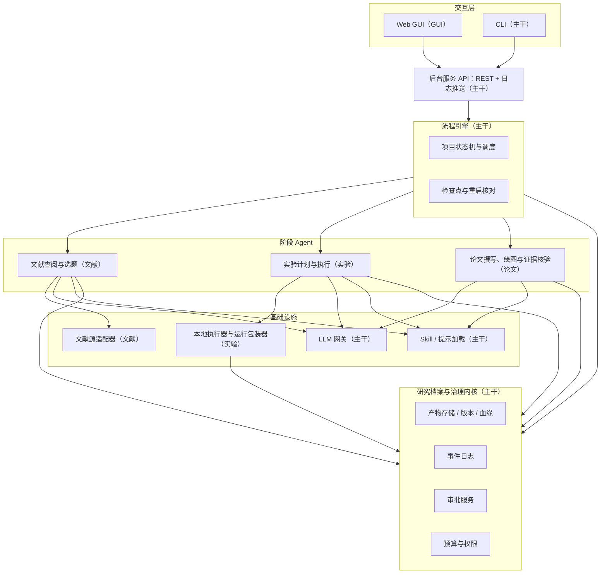
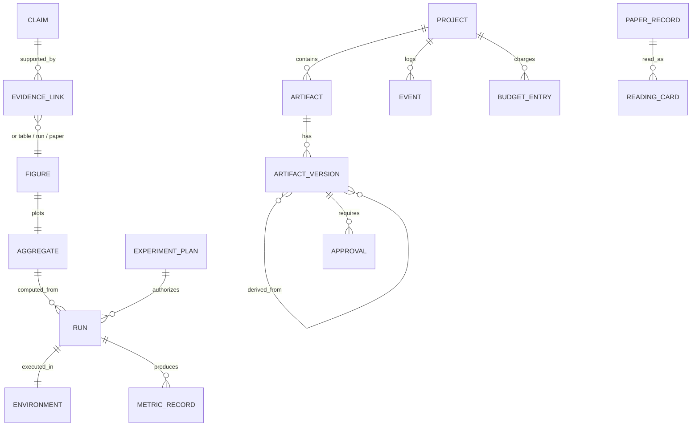
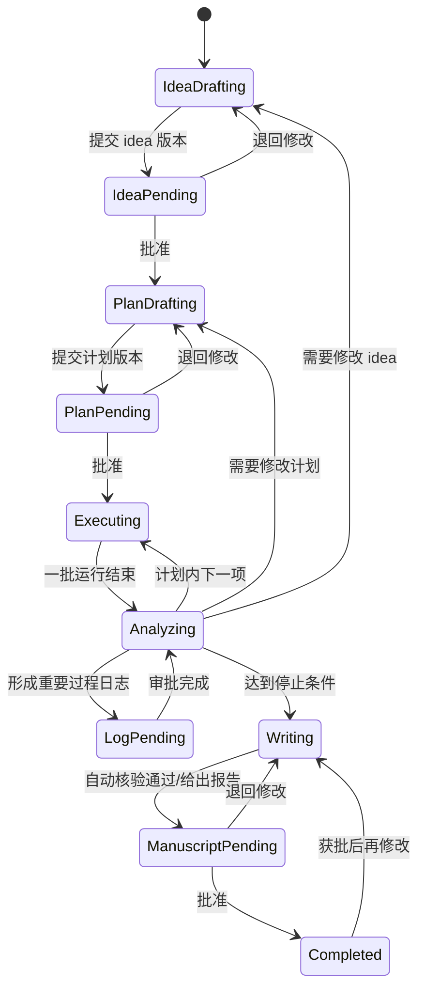
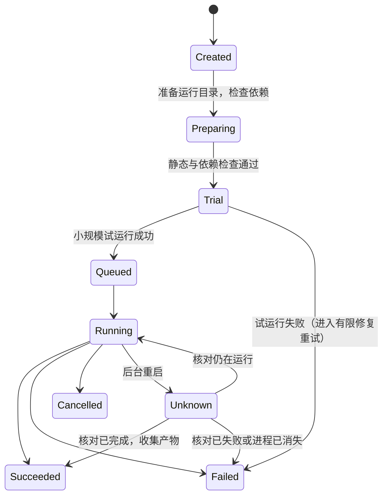

# AI Researcher Agent：概要设计

**文档版本：** v0.2  
**编写日期：** 2026-10-07  
**依据：** 《AI Researcher Agent：需求分析》v1.3、Group 6 Project Proposal  
**配套文档：** 《AI Researcher Agent：项目说明与分工》（面向全体成员的通俗版）  
**文档状态：** 概要设计稿；各模块的字段、接口细节和算法在后续详细设计中确定

**v0.2 变更：** 改为按“主干 + 三个阶段 Agent + GUI”分工；本期只做本地执行，SSH 推迟；GUI 改用 React 或 Vue；排期改为三周。

## 1. 文档说明

### 1.1 目的

本文把需求分析中的功能需求落到一个可分工开发的系统结构上，回答四个问题：

1. 系统由哪些模块组成，各自负责哪些需求编号；
2. 模块之间通过什么数据和接口协作，哪些约定必须在开发初期冻结；
3. 关键流程（审批、实验运行、恢复、证据追溯）如何在模块间流转；
4. 5 名成员如何分工，以及三周内如何排期。

### 1.2 与详细设计的关系

概要设计只确定**模块边界、核心数据实体、跨模块接口的形态和关键设计决策**。以下内容留给各模块的详细设计：具体字段类型、REST 路由清单、提示词、检索源与 API、GUI 页面细节、算法和阈值。第 14 节列出每个角色的详细设计必须回答的问题。

### 1.3 角色与术语

| 简称 | 角色 | 负责人 |
|---|---|---|
| 【主干】 | Agent 主干 | ZHU YANG（组长） |
| 【文献】 | 文献查阅与选题 Agent | 待定 |
| 【实验】 | 实验计划与执行 Agent | 待定 |
| 【论文】 | 论文撰写与绘图 Agent | 待定 |
| 【GUI】 | GUI 开发 | 待定 |

| 术语 | 含义 |
|---|---|
| 产物（Artifact） | 研究档案中任何被版本化的对象：idea、计划、代码快照、运行记录、图表、论文、重要日志等 |
| 运行（Run） | 一次具体的实验执行，有唯一 `run_id` |
| 阶段 Agent | 在某个阶段内调用 LLM 和工具完成工作的组件，即文献、实验、论文三个阶段 |
| 流程引擎 | 确定性代码实现的项目级状态机，决定当前阶段、何时等待审批、何时暂停 |
| 论断（Claim） | 论文中的一条陈述，尤其是数字型结论或对实验结果的定性判断 |

### 1.4 本期范围

剩余开发时间约三周。下列需求本期推迟或简化，需求分析 v1.3 中已同步标记。设计上仍为它们预留扩展点，不在主流程中写死“只能本地”。

| 内容 | 处理 | 设计上的预留 |
|---|---|---|
| SSH 远程执行与断线恢复（FR-60、FR-61） | 推迟，只做本地执行 | 执行器接口按“本地/远程”抽象；运行包装器统一写状态文件 |
| 候选 idea 自动生成（FR-11、17、18） | 本期不做 | idea 阶段的输入格式兼容“领域约束” |
| 对照实验规模 | 按成本试点结果确定 | 评价工具支持任意轨迹数 |
| 非 NLP 迁移检查 | 视时间完成 | 领域知识只在任务配置中 |
| GUI 版本差异对比 | 可退化为并列显示全文 | API 返回两个版本的内容 |

## 2. 设计原则与关键决策

| # | 决策 | 理由 | 相关需求 |
|---|---|---|---|
| D1 | **流程由确定性引擎控制，LLM 只在阶段内部工作。** 阶段切换、审批等待、预算停止由代码判断，不交给 LLM 决定 | 保证审批、预算和权限不能被模型输出或提示注入绕过 | FR-50、FR-05、7.3 |
| D2 | **文件系统是事实来源，SQLite 只做索引和任务状态。** 产物以人可读文件存放在项目工作区，原始日志与指标只追加 | 便于人工检查、git 管理和离线评审；索引损坏可从文件重建 | FR-01~04、7.1 |
| D3 | **产物版本按内容哈希寻址，审批绑定 `(artifact_id, version, sha256)`** | 修改后旧批准自动失效；过期或重复审批可被识别 | FR-16、FR-50、FR-72 |
| D4 | **单一后台进程，CLI 与 GUI 都是它的客户端** | CLI/GUI 共享状态、权限和任务；关闭客户端不影响后台任务 | FR-70~73 |
| D5 | **原始指标由运行包装器写入，汇总由确定性脚本完成** | LLM 不能改写或补写结果；数字可重新计算核对 | 6.6、FR-32 |
| D6 | **运行包装器在运行目录写状态文件，后台据此判断运行状态**，不依赖进程句柄或连接 | 后台重启后能核对本地运行的真实状态；以后加入 SSH 时同一机制可用于断线核对 | FR-04、FR-73（本期）；FR-61（以后） |
| D7 | **LLM 调用统一经过网关**，记录模型、提示版本、用量和耗时 | 预算计量、多模型路由和实验可复现 | FR-13、7.4 |
| D8 | **领域知识通过任务配置和 skills 注入**，主流程不出现 NLP 专有字段 | 满足跨领域适配和非 NLP 迁移检查 | 3.2、8.1 |
| D9 | **论断-证据检查是可开关的独立组件** | 主对照实验需要“有/无证据检查”两种配置，其余机制保持一致 | 8.3 |
| D10 | **主干提供“示例阶段”和“样例项目”，阶段 Agent 照此编写** | 组员没有 Agent 开发经验；样例项目让论文和 GUI 不必等实验跑出真实数据 | — |

## 3. 总体架构

### 3.1 分层结构



依赖方向自上而下：上层只调用下层接口，内核不依赖任何阶段 Agent。三个阶段 Agent 之间**不直接调用**，只通过研究档案中的交接文件协作（见 7.5）。

### 3.2 各层职责

| 层 | 职责 | 不负责 |
|---|---|---|
| 交互层 | 展示状态、提交用户决定、上传模板、查看/控制运行、导出产物 | 任何研究逻辑；CLI 和 GUI 不各自实现流程 |
| 后台服务 | 对外暴露项目、审批、运行、产物的接口；校验请求版本；推送日志 | 业务判断 |
| 流程引擎 | 维护项目状态机；按状态调用阶段 Agent；遇到待审批、预算耗尽或错误时暂停；重启后恢复 | 生成内容 |
| 阶段 Agent | 在获批范围内完成本阶段工作，产出新的产物版本或审批请求 | 自行跳过审批、修改原始结果 |
| 研究档案与治理内核 | 版本化存储、事件日志、审批、预算记账、权限检查 | 理解产物内容 |
| 基础设施 | 模型调用、skill 加载、文献检索、代码执行 | 决定研究方向 |

### 3.3 部署形态

- 用户在本机启动一个后台服务进程（含流程引擎和任务 worker），CLI 和浏览器 GUI 通过本地 HTTP 访问；
- 项目工作区和实验执行都在本机；
- GUI 开发时通过前端开发服务器运行；交付时打包成静态文件，由后台服务直接提供。

## 4. 核心数据模型

实体名称沿用需求分析 6.3 节。概要设计只规定实体之间的关系和必须具备的关键属性，字段类型在详细设计中确定：【主干】负责汇总统一，其他实体由负责的角色起草。



| 实体 | 关键属性（概要） | 起草 |
|---|---|---|
| Project | 目标、约束、预算上限、权限策略、模型与工具配置、`evidence_check` 开关 | 主干 |
| ArtifactVersion | `artifact_id`、`kind`、`version`、`sha256`、文件路径、父版本、生成者（agent/human-edited）、创建时间 | 主干 |
| Approval | 目标版本三元组、类别（idea/plan/log/manuscript）、变更摘要、影响范围、状态（pending/approved/changes_requested/rejected/superseded）、意见、时间 | 主干 |
| Event | 时间、类型、主体、关联产物、摘要；只追加 | 主干 |
| BudgetEntry | 资源类别（LLM 用量、CPU/GPU 时间、墙钟时间、存储）、数量、来源 | 主干 |
| PaperRecord / ReadingCard | 论文唯一标识、元数据、检索快照、可访问层级（全文/摘要）；阅读卡带角色、来源位置，并区分作者结论与 Agent 推断 | 文献 |
| Idea（`selected.md`） | 研究问题、动机、假设、贡献、任务和数据、基线、指标、预算、停止条件、引用 | 文献 |
| ExperimentPlan | 实验矩阵、变量、基线、对照/消融、重复策略、停止条件 | 实验 |
| Run / Environment / MetricRecord | `run_id`、所属计划版本与实验 ID、代码提交、配置哈希、输入版本、执行位置、状态；环境快照；只追加的原始指标 | 实验 |
| Aggregate | 汇总脚本版本、输入 `run_id` 列表、汇总方式 | 实验 |
| Figure | 生成脚本、生成配置、引用的 Aggregate | 论文 |
| Claim / EvidenceLink | 论断文本与位置、类型（数字/定性/引用）、支持程度；证据指向运行、指标、评价条件、汇总方式或文献 | 论文 |

**跨角色格式需共同确定：** 证据链（Run → Aggregate → Figure → Claim）涉及【主干】【实验】【论文】三方；`selected.md` → ExperimentPlan 涉及【文献】【实验】两方。这两组格式在第 1 周由相关负责人一起确定。

## 5. 关键流程

### 5.1 项目状态机（流程引擎，【主干】）



另有三个可从任意活动状态进入的状态：`Paused`（用户暂停或等待决策）、`BudgetExhausted`、`Failed`。进入时都写检查点和事件，恢复前先执行重启核对（5.4）。

引擎约定：

- 每个阶段 Agent 实现一个**幂等的 `step(ctx)`**，返回以下结果之一：`produced(新版本)`、`needs_approval(审批请求)`、`continue`、`stop(原因)`、`error(可重试/不可重试)`。引擎在每次 `step` 后持久化检查点；
- 等待审批时，引擎只调度与待审内容无依赖、且已获批的工作；
- 审批“通过”只对绑定的版本生效。若产物已有更新版本，旧请求标记为 `superseded`，针对该请求提交的决定会被拒绝（返回冲突）；
- idea 变更时，引擎把依赖它的计划和手稿标记为“需重新评估”，由对应阶段 Agent 判断是否须重新提交审批。

### 5.2 实验运行生命周期（【实验】）



- 每次重试产生新的 `run_id`，并通过 `retry_of` 与原运行关联，失败运行不会被覆盖；
- 修复重试只允许不改变方法语义和评价条件的改动；否则实验 Agent 必须提交计划修订；
- 运行包装器在运行目录写入 `status.json`（含进程号、开始时间、心跳）、只追加的 `metrics.jsonl`、`stdout.log` 和 `stderr.log`；执行器根据这些文件判断状态；
- GPU 运行默认串行。

### 5.3 审批流程

1. 阶段 Agent 产出新版本后，调用内核的 `request_approval(version_ref, kind, summary, impact)`；
2. 引擎把项目状态切到对应的 `*Pending`，GUI/CLI 的审批列表通过 API 读到它；
3. 用户的决定提交时携带所审版本的哈希；后台校验它仍是当前待审版本，并按请求 ID 去重，保证重复点击不会重复触发实验；
4. 决定写入 `approvals/` 和事件日志，引擎从检查点继续。

重要过程日志的审批不阻止原始记录保存。被退回的日志保留原文，修订版作为新版本追加。

### 5.4 中断与恢复

后台启动时依次执行：

1. 从文件重建/校验 SQLite 索引；
2. 读取每个项目的最后检查点；
3. 对所有处于 `Running/Queued/Unknown` 的运行调用执行器的 `reconcile()`，根据状态文件和进程是否存在确定真实状态；
4. 已结束的运行收集产物；仍在运行的重新接入日志；无法确认状态的保持 `Unknown` 并提示用户；
5. 引擎从检查点继续，不重新启动已有运行。

### 5.5 证据追溯链

```text
论文论断 (Claim)                                        ← 论文
  └─> 表格 / 图表 (Figure, 含生成脚本与配置)              ← 论文
        └─> 汇总结果 (Aggregate, 含汇总脚本版本与全部输入 run_id)  ← 实验
              └─> 运行记录 (Run: 状态、原始指标、日志)       ← 实验
                    ├─> 代码提交 (项目工作区 git commit)     ← 主干
                    ├─> 配置文件哈希
                    ├─> 数据 / 工作负载版本与校验值
                    └─> 环境快照 (Environment)              ← 实验
```

论断-证据检查（【论文】）沿这条链从下往上重新计算数字，并与论文中的数值、样本数、评价条件和对照条件比对。只存在文件链接而数值对不上的，判为不一致。

## 6. 模块与需求映射

| 模块 | 主要组件 | 覆盖需求 | 负责 |
|---|---|---|---|
| 研究档案与治理内核 | 工作区管理、产物版本与血缘、事件日志、审批服务、预算记账、权限守卫 | FR-01~05、FR-50~52、FR-54、6.3、7.1 | 主干 |
| 流程引擎 | 项目状态机、阶段调度、检查点、重启核对编排 | FR-04、FR-36（流转部分）、6.4、FR-73 | 主干 |
| Agent 基础设施 | LLM 网关、Skill/提示加载、示例阶段、样例项目 | FR-13（用量记录）、6.5（加载机制）、7.4 | 主干 |
| 后台服务与 CLI | REST API、日志推送、CLI | FR-53（入口）、FR-70、FR-72 | 主干 |
| 文献查阅与选题 | 文献源适配器、多 Agent 文献协作、idea 精炼与评分、差异表、`selected.md`、引用核验服务 | FR-10、FR-12~16、FR-43（来源核验）、6.1~6.2 | 文献 |
| 实验计划与执行 | 计划生成与检查、编码 Agent、本地执行器与运行包装器、环境快照、结果汇总、分析与下一步决策、领域任务配置 | FR-20~32、FR-34~37、FR-62（本地）、6.7（本地部分） | 实验 |
| 论文撰写与绘图 | 绘图 skill、LaTeX 写作 skill、模板导入与编译、论断-证据矩阵、claim-review | FR-33、FR-40~48、6.5（两个 MVP skill）、6.6 | 论文 |
| Web GUI | 项目创建、状态、审批、运行查看与控制、产物与证据查看、导出 | FR-71、FR-73（前端部分）、6.8 | GUI |

## 7. 模块接口契约（概要）

以下以 Python 签名示意接口形态。名称和参数在详细设计中可以调整，但**语义要在第 1 周冻结**。接口提供方需同时给出一个可用的假实现（fake），让调用方在依赖完成前就能开发和测试。

### 7.1 内核（【主干】提供，所有阶段使用）

```python
archive.put(project, kind, content_or_path, parents, producer) -> VersionRef  # (artifact_id, version, sha256)
archive.get(ref) / archive.latest(project, artifact_id) / archive.lineage(ref)
events.append(project, type, subject, refs, summary)
approvals.request(ref, kind, summary, impact) -> ApprovalId
approvals.decide(approval_id, expected_sha256, decision, comment, request_id)
budget.charge(project, category, amount, source); budget.check(project) -> BudgetStatus
permissions.guard(project, action, target)   # 不通过则抛出异常并记日志
```

### 7.2 流程引擎（【主干】定义，阶段 Agent 实现）

```python
class Stage(Protocol):
    name: str
    def step(self, ctx: StageContext) -> StepResult: ...   # 幂等，可在任意检查点重入
```

`StageContext` 提供当前项目、已批准版本的引用、预算状态，以及内核与基础设施的句柄。【主干】提供一个完整的示例阶段，展示如何调用 LLM、校验 JSON 输出并重试、保存产物和提交审批。

### 7.3 Agent 基础设施（【主干】提供）

```python
llm.complete(role, messages, tier="fast" | "strong", prompt_id, prompt_version,
             tools=None, response_schema=None) -> Response
# 网关负责模型路由、重试、输出格式校验、用量记账（写入 budget）与调用日志
skills.load(name, version=None) -> Skill      # 说明、输入输出说明、模板/脚本、验证规则
```

### 7.4 执行器（【实验】实现）

```python
class Executor(Protocol):
    def probe(self) -> EnvironmentReport          # 工具链、磁盘、CPU/GPU
    def prepare(self, run: RunSpec) -> None       # 准备运行目录，记录输入校验值
    def submit(self, run: RunSpec) -> JobHandle
    def status(self, handle) -> RunStatus
    def logs(self, handle, offset) -> LogChunk
    def cancel(self, handle) -> None              # 只取消归属本运行的进程
    def collect(self, handle) -> RunOutputs
    def reconcile(self, handle) -> RunStatus      # 后台重启后核对
    def snapshot_env(self, handle) -> Environment
```

本期只实现 `LocalExecutor`。`RunSpec` 只包含可执行入口、配置、输入、目标环境、资源上限和超时，不含任何领域专有字段。以后加入 `SSHExecutor` 时只需实现同一接口。

### 7.5 阶段之间的交接文件

阶段之间不互相调用函数，只通过研究档案交接：

| 交接物 | 产出 | 使用 |
|---|---|---|
| `idea/selected.md`、`idea/literature.jsonl` | 文献 | 实验、论文、GUI |
| `plan/experiment_plan.md` | 实验 | 论文、GUI |
| `runs/<run_id>/`（状态、指标、日志、环境） | 实验 | 论文、GUI |
| `artifacts/aggregates/`（汇总表与汇总脚本） | 实验 | 论文 |
| `paper/`（LaTeX、PDF、`claims.jsonl`、检查报告） | 论文 | GUI |
| `approvals/`、项目状态、预算 | 主干 | 所有人 |

另外有两个函数式接口：

```python
literature.verify_citation(paper_id) -> CitationStatus   # 文献提供，论文调用
evidence.check(paper_ref) -> CheckReport                 # 论文提供，引擎和 GUI 调用
```

### 7.6 后台 API（【主干】提供，【GUI】使用）

资源划分为：项目、审批、运行、产物、文献、论文、证据。所有写操作都携带客户端请求 ID 和目标版本哈希；日志和状态变化通过 SSE 推送。FastAPI 自动生成的接口说明页即作为 GUI 的对接文档。路由清单在【主干】的详细设计中确定，第 1 周末先给出初版，供 GUI 用假数据开发。

## 8. 工作区与代码仓库结构

### 8.1 项目工作区

沿用需求分析 5.1 节建议的目录，并补充以下约定：

- `src/` 和 `configs/` 是一个 git 仓库，运行记录绑定提交哈希；Agent 修改代码后由内核自动提交；
- `runs/<run_id>/` 下的文件由运行包装器和执行器写入，其他阶段只读；
- `paper/claims.jsonl` 存放论断-证据矩阵；
- `.index/` 存放 SQLite 索引，可删除后重建。

### 8.2 代码仓库

```text
ai-researcher-agent/
├── pyproject.toml
├── airesearcher/
│   ├── core/          # 主干：数据模型、产物存储、事件、审批、预算、权限
│   ├── engine/        # 主干：状态机、调度、检查点、恢复
│   ├── llm/           # 主干：LLM 网关
│   ├── skills/        # 主干：skill 加载器
│   ├── server/        # 主干：后台 API
│   ├── cli/           # 主干：CLI（调用后台 API）
│   ├── stages/
│   │   ├── example/   # 主干：示例阶段
│   │   ├── idea/      # 文献：文献源适配器、多 Agent 阅读、idea、selected.md
│   │   ├── experiment/# 实验：计划、编码 Agent、汇总、分析决策
│   │   └── writing/   # 论文：论文生成、模板、编译、证据矩阵、claim-review
│   └── runtime/       # 实验：执行器、运行包装器、环境快照
├── skills/            # skill 包：paper-reading(文献) experiment-planning(实验)
│                      #          scientific-plotting(论文) latex-writing(论文) claim-review(论文)
├── tasks/             # 实验：领域任务配置与实验模板
├── web/               # GUI：前端工程
├── fixtures/
│   └── sample_project/# 主干：手工样例项目，全组共用的测试数据
├── eval/              # 评价脚本与批量运行工具（见第 12 节）
└── tests/             # 单元测试 + 跨模块契约测试
```

数据模型按实体拆成多个文件，由起草人维护，以减少合并冲突。

## 9. 技术选型建议

以下为建议，最终选择在详细设计中确认。需求分析中明确留待后续设计的服务商、价格和检索策略，这里不做规定。

| 方面 | 建议 | 说明 |
|---|---|---|
| 语言 | Python 3.11+ | 与实验代码和 LLM 生态一致 |
| 数据模型 | Pydantic | 同时用于校验、序列化和 API schema |
| 索引与任务状态 | SQLite | 单机单用户足够，可从文件重建 |
| 后台服务 | FastAPI + SSE | 异步任务和日志推送方便，自动生成接口文档 |
| CLI | Typer | 只调用后台 API，不直接访问内核 |
| GUI | React 或 Vue（第 1 周由【GUI】选定），配合组件库（Ant Design / Element Plus），用 Vite 构建 | 尽量使用现成组件，减少样式和交互的开发量 |
| 本地执行 | `subprocess` 启动运行包装器，进程脱离后台运行，状态写文件 | 后台重启不影响正在运行的实验 |
| LLM 接入 | 自建薄网关，内部可用 LiteLLM 等多供应商封装 | 不绑定单一供应商，便于按角色配置模型 |
| 编码 Agent | 基于 LLM 网关的简单工具调用循环（读文件、写文件、试运行、读日志），工具调用必须经过权限守卫 | 在实验模板上修改，而不是从零生成 |
| LaTeX | `latexmk`，禁用 shell-escape，在项目目录内编译 | 模板视为不可信输入 |
| 绘图 | matplotlib，脚本与数据一起归档 | 统计图必须由真实结果生成 |

## 10. 分工方案

### 10.1 各角色工作量

点数为相对估算（1 点约为半天到一天的专注工作），只用于比较各角色的轻重。“学习成本”指在没有相关经验时需要额外投入的学习时间，不计入点数。

| 角色 | 开发内容（点数） | 评价任务（点数） | 合计 | 学习成本 |
|---|---|---|---|---|
| **主干** | 档案/版本/事件 5；审批 3；预算与权限 2；流程引擎 5；LLM 网关 2；skill 加载 1；API 与 CLI 3；示例阶段与样例项目 2 | 批量运行工具 2；恢复测试 1 | 26 | 低 |
| **文献** | 文献源适配器与检索快照 3；多 Agent 协作阅读 5；idea 评分、差异表与 `selected.md` 3；引用核验 1 | 单 vs 多 Agent 文献对比 3；提示注入测试 1；盲评 1 | 17 | 中 |
| **实验** | 计划生成与执行前检查 4；编码 Agent 与修复重试 5；本地执行器、运行包装器与环境快照 4；结果汇总 2；分析与下一步决策 4；演示任务模板 2 | 成本试点与实验能力指标 2 | 23 | 中 |
| **论文** | 绘图 skill 3；LaTeX 写作与模板编译 5；论断-证据矩阵 4；claim-review 4 | 主对照协议、评分标准与盲评组织 3；复现核心实验 1 | 20 | 中 |
| **GUI** | 六类页面 6；接口对接与状态刷新 2 | 端到端演示与场景验收 2；盲评 1 | 11 | **高**（从零学前端框架） |

**均衡性说明：**

- 【主干】最重，另外还要承担集成、代码评审和技术支持，这是组长角色的预期。第 1 周要优先交付示例阶段、样例项目和接口初版，因为其他人都依赖这些。
- 【GUI】点数少，但学习成本高，实际投入与其他人接近。
- 【实验】比【文献】重约 6 点。**建议在第一次组会上决定是否把“实验计划生成与执行前检查”（4 点）移给【文献】。** 移过去后，【文献】负责从想法到计划的“研究设计”（21 点），【实验】专注写代码、运行和分析（19 点）；这两部分的交接点也会从 `selected.md` 变为 `experiment_plan.md`，后者的格式更具体，衔接更清楚。

### 10.2 交叉任务

需求分析 8.3 节要求部分检查由未编写相应流程的成员完成：

| 任务 | 负责 | 理由 |
|---|---|---|
| 主对照的论文盲评（两人独立评分） | GUI、文献 | 都没有参与证据检查和实验流程的实现 |
| 在干净环境复现核心实验 | 论文 | 没有编写实验流程 |
| 提示注入与不可信内容测试 | 文献 | 最常处理外部网页和论文内容 |

### 10.3 代码评审

- 【主干】评审所有合并到 `main` 的 PR，重点检查接口使用和数据安全（不改原始结果、不泄露密钥）；
- 组员之间两两互看，重点检查“看不看得懂”；
- 跨模块接口或交接文件格式的变更，需相关负责人一致同意。

## 11. 三周排期与集成

### 11.1 每周交付

| | 第 1 周：打地基 | 第 2 周：连起来 | 第 3 周：评价与交付 |
|---|---|---|---|
| **主干** | 仓库骨架与 CI；数据模型与内核接口；档案存储；LLM 网关；示例阶段；样例项目；API 初版说明 | 流程引擎、审批、预算；API 全量；CLI；周中用 CLI 跑通全流程 | 批量运行工具；跑对照实验；恢复测试；修复问题；整合报告 |
| **文献** | 检索 10~20 篇论文并保存文献记录；`selected.md` 格式定稿 | 多角色阅读与合并、idea 评分、差异表、生成 `selected.md`、引用核验 | 单 vs 多 Agent 对比；提示注入测试；盲评 |
| **实验** | 选定演示任务；手写可运行的基线；本地执行器与运行包装器；计划和运行记录格式定稿 | 计划生成、编码 Agent、试运行与修复、汇总、分析决策 | 成本试点；实验能力指标；非 NLP 配置（视时间） |
| **论文** | 基于样例项目画图、生成 LaTeX 并编译；`claims.jsonl` 格式定稿 | 论断-证据矩阵、claim-review、用户模板 | 主对照协议与评分标准、组织盲评、复现核心实验 |
| **GUI** | 选定框架；用假数据做出项目状态页和审批列表 | 接入真实 API；运行日志、产物查看、PDF 预览、证据跳转 | 端到端演示录屏；场景验收；盲评 |

每个人在第 3 周都要撰写最终报告中自己负责的章节。

### 11.2 检查点

| 时间 | 检查内容 | 不达标时的处理 |
|---|---|---|
| 第 1 周末 | 接口与交接格式冻结；样例项目可用；每个阶段能独立运行出最小结果 | 推迟第 2 周的增强功能，先补齐接口 |
| 第 2 周中 | CLI 跑通：用户 idea → 批准计划 → 本地运行 → 汇总 → 编译论文草稿 | 主干和实验优先修复主流程 |
| 第 2 周末 | GUI 跑通：输入想法 → 两次审批 → 基线和对比实验 → 可编译的论文草稿 | 第 3 周第一天全员修主流程，其余功能暂停 |
| 第 3 周中 | 配置冻结，开始对照实验 | 缩减轨迹数，并在报告中说明 |

### 11.3 并行开发保障

- **假实现：** 每个接口提供方同时交付假实现，调用方不必等待真实实现；
- **样例项目：** `fixtures/sample_project/` 包含手写的 `selected.md`、实验计划、几次运行记录、汇总表和一张图，让【论文】【GUI】在实验跑出真实数据前就能开发；
- **真实 LLM 尽早可用：** LLM 网关在第 1 周前几天交付最简版本，因为文献、实验、论文三个阶段的核心逻辑都无法用固定回复来开发；
- **每周集成：** 每周至少一次在 `main` 上运行端到端冒烟测试，使用最小任务；
- **契约测试：** 由接口提供方编写，调用方修改调用前先确认测试能通过。

## 12. 评价工作的落点

需求分析要求端到端体验、Agent 能力创新、严格实验比较三方面同等重视（1:1:1）。评价工作分散在各角色中，而不是最后一周才开始：

| 评价支柱 | 内容 | 主要负责 | 依赖 |
|---|---|---|---|
| 端到端体验 | GUI 完整演示、场景验收清单（需求分析第 12 节，SSH 场景除外）、完成率与操作负担 | GUI | 全体 |
| Agent 能力创新 | 文献协作对比（文献）；证据核验效果（论文）；自主分析与后续实验案例（实验） | 文献、论文、实验 | 主干的批量运行工具 |
| 严格实验比较 | 主对照（有/无证据检查）协议、成本试点后确定轨迹数、盲评、复现 | 论文主导协议，主干负责批量运行，GUI 和文献盲评，论文复现 | 实验的演示任务 |

批量运行工具（【主干】）需要支持：按配置批量启动项目轨迹、切换 `evidence_check` 开关、固定检索快照与模型/提示版本、导出用量和失败记录。各项指标的计算脚本由对应支柱的负责人编写，放在 `eval/` 下。

## 13. 主要风险

| 风险 | 影响 | 应对 |
|---|---|---|
| 主干成为瓶颈 | 其他四人第 1 周无法开工 | 优先交付接口、假实现、示例阶段、样例项目；内核先用最简单的文件实现 |
| 组员缺少开发经验 | 进度慢、代码质量不稳定 | 照着示例阶段写；使用 AI 编程助手，但要求自己读懂；卡住半天以上立即求助 |
| GUI 从零学习框架 | 第 2 周末无法演示 | 使用组件库；第 1 周末检查进度，明显落后时由主干协助或缩减页面 |
| 编码 Agent 质量不稳定 | 实验闭环跑不通 | 先提供实验模板，Agent 在模板上修改；修复重试设上限，超限交给人工 |
| 三周时间不足 | 评价做不完 | 第 2 周末检查点必须达成；对照实验规模按成本试点结果确定 |
| SSH 推迟 | 不满足需求分析中的必须项 | 接口预留扩展；最终报告如实说明限制 |
| LLM 调用成本超预期 | 无法完成对照实验 | 网关统一记账；开发时使用便宜的模型和样例数据 |
| 证据核验依赖结构化数据，而写作阶段自由生成 | 论断难以自动绑定 | 写作 skill 先产出“论断清单 + 证据引用”，再据此生成正文，而不是事后从正文中抽取 |

## 14. 详细设计待定项

各角色的详细设计至少需要回答以下问题，建议在第 1 周内完成，篇幅以 2~4 页为宜。

**主干**
- 各实体的字段与文件格式；SQLite 表结构；索引重建流程
- 版本号规则、血缘记录方式、`human-edited` 检测
- 状态机的完整转换表、检查点内容、并发控制
- 权限策略的配置格式；预算阈值与超限行为
- 模型分层（fast/strong）与路由规则；skill 包的目录结构与版本验证方式
- REST 路由清单与推送机制

**文献**
- 文献源选择、API 限额、检索快照格式、去重规则
- 各文献角色和协调者的提示词与输出格式；冲突合并策略
- idea 评分维度及打分方法；`selected.md` 模板

**实验**
- 演示任务的选择与实验模板
- 实验计划格式与执行前检查项（数据许可、数据泄漏、公平性）
- 运行包装器协议（状态文件、指标格式、退出码约定）；环境快照包含哪些内容
- 编码 Agent 的工具集、上下文管理与修复重试策略
- 汇总脚本规范；分析决策规则，以及如何判定“有效进展”

**论文**
- `Claim` / `EvidenceLink` 格式；支持程度分级
- 从论断清单生成 LaTeX 正文的流程；模板入口识别与编译检查
- claim-review 的检查项、数值容差和报告格式
- 主对照的评分标准、盲评流程和分歧处理

**GUI**
- 框架和组件库的选择
- 页面清单、页面跳转关系和每个页面需要的 API
- 日志实时刷新的方式；审批提交的防重复处理；PDF 预览方案
