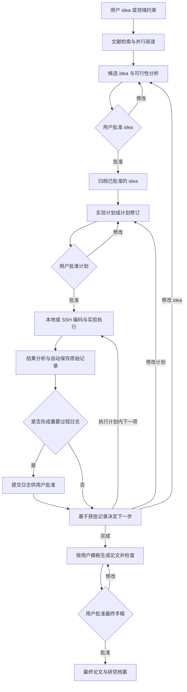

# AI Researcher Agent：需求分析

**文档版本：** v1.3  
**面向课程：** DSA4213 Natural Language Processing for Data Science  
**项目方向：** Autonomous Research  
**编写日期：** 2026-09-20（v1.3 修订：2026-10-07）  
**文档状态：** 需求分析稿；具体服务选型、预算和实验规模在后续设计中确定  
**适用范围：** 面向计算机科学领域、可通过代码与计算环境开展的研究；NLP 可作为演示任务，不限定产品范围

> **v1.3 本期范围调整：** 剩余开发时间约三周，以下内容在本期推迟或简化，需求本身保留不删。正文中用 **〔本期推迟〕**、**〔本期简化〕** 标记。最终报告须如实说明这些限制。
>
> | 内容 | 处理 | 涉及位置 |
> |---|---|---|
> | SSH 远程执行与断线恢复 | 推迟，本期只做本地执行 | FR-60、FR-61、FR-62（仅本地）、6.7、2.3、10.1、第 12 节 |
> | 领域探索模式自动生成候选 idea | 本期不做，只完善用户给出的 idea | FR-11、FR-17、FR-18 |
> | 对照实验规模（18 条轨迹） | 先做成本试点，再确定实际规模 | 8.3 |
> | 非 NLP 配置迁移检查 | 视时间完成 | 8.1 |
> | GUI 中的版本差异对比 | 可退化为并列显示两个版本全文 | 6.8 |

## 1. 项目概述

### 1.1 背景

课程示例中的 Autonomous Research 方向将 AI Scientist 概括为一条完整链路：提出研究想法、修改并运行实验代码、整理结果、撰写论文。示例还提出了几个适合课程项目落地的扩展点：保存研究笔记，记录被采用和被放弃的想法；由异常结果触发复现或后续实验；让论文中的结论追溯到具体运行、代码和图表；研究 Agent 如何选择信息量更高的实验，以及如何检查自己对结果的解释。

本项目拟开发一个 **AI Researcher Agent**。它接受用户给出的研究问题，或者在用户指定的计算机领域内主动寻找研究机会，经过文献调研和可行性筛选后冻结一个研究计划；随后自动编写和运行计算实验，基于结果决定是否继续下一轮；最后把可追溯的实验证据组织成 LaTeX 论文和论文图表。

### 1.2 产品愿景

让一个计算机领域的研究者能够从“我想研究什么”或“请在这个方向找一个可做的问题”开始，在一个可恢复、可审计的项目工作区中获得：

1. 一份有文献证据支持、范围明确、可在给定算力内完成的研究方案；
2. 一组可复现的实验代码、配置、日志、数据和结果；
3. 一篇每个主要结论都链接到实验运行和图表的 LaTeX 初稿；
4. 一份清楚记录成功、失败、放弃原因和待办事项的研究档案。

### 1.3 一分钟演示场景（仅作示例，不限制产品领域）

用户输入：“研究轻量级文本分类模型在低资源场景下的参数高效微调方法，使用公开数据集和单张 GPU，预算 6 小时。”

演示中，Agent 会：

1. 检索并总结近期论文，提出若干候选问题，并展示新颖性、可行性和风险评分；
2. 与用户确认一个候选 idea，生成并保存 `selected.md` 和文献证据表；
3. 生成实验计划，经用户批准后在本地或 SSH 服务器编写和运行实验，保存配置、环境、日志、指标和图表；
4. 发现某个结果不稳定时提交重要过程日志和复现实验计划供用户批准，或在预算耗尽时停止并说明原因；
5. 按用户上传的 LaTeX 模板生成论文草稿，校验后提交最终手稿审批；
6. 展示“论文结论 -> 图表 -> 实验运行 -> 代码提交 -> 配置/数据版本”的追溯链。

### 1.4 建议聚焦的研究问题与小组贡献

**推荐课程项目研究问题：在固定计算与模型调用预算下，使用版本化研究档案和论断-证据检查的 Agent，能否降低论文中的无证据论断，并提高实验的可复现性？**

推荐把“跨阶段证据追踪与结论核验”作为主要贡献：小组自己设计结构化研究档案、证据绑定规则、状态转换及一致性检查，而文献检索、代码执行和 LaTeX 编译可以使用现成工具。自适应实验选择是增强项，多 Agent 是一种实现手段，不预设它一定优于单 Agent。

三个阶段面向整个计算机科学领域，通用流程不得依赖固定 NLP 任务、数据集、模型或指标。演示可选择一个规模受控的 NLP 任务，任务知识与实验模板通过项目配置和 skills 提供。算法、软件工程、计算机系统、数据库、网络、机器学习等方向，只要能在已配置的计算环境内执行并评价实验，都属于目标范围；某个具体任务是否可行由环境和资源条件决定。

Agent 在已批准的 idea、实验计划和资源范围内自主分解、编码、执行和检查；idea 或实验计划修改、重要过程日志及最终手稿进入用户审批流程。端到端体验、Agent 能力创新和严格实验比较按用户明确的 **1:1:1** 同等重视，证据追踪仍是建议的技术贡献，不取代另两方面的建设。

### 1.5 依据与假设

本分析依据课程示例 PDF 第 22--23 页的自主研究示例、第 38--40 页的贡献与评价建议，以及本地 proposal 模板中的问题、贡献、Agent 设置、实验比较、评价和风险栏目。端到端体验、Agent 能力创新和实验比较按 1:1:1 规划，不将这一比例视为已独立核验的课程官方分值；截止日期、具体预算及未提供的硬性要求不作推定。本文没有另行进行最新研究文献检索，相关工作清单需在选题后补充核验。

## 2. 目标、非目标与成功标准

### 2.1 项目目标

- **G1：研究问题落地。** 将模糊想法转换为可检验的假设、变量、数据/工作负载/测试用例、评价指标和停止条件。
- **G2：研究循环自动化。** 支持“计划 -> 编码 -> 运行 -> 分析 -> 决定下一步”的多轮循环，并能从结果中生成后续实验。
- **G3：证据可追溯。** 研究方案、代码、环境、数据、运行结果、图表和论文中的论断保持可关联。
- **G4：过程可恢复。** 中断后可从最近一个稳定检查点继续；用户可查看、修改和回滚每一项重要决策。
- **G5：在课程周期内可验证。** 使用规模受控的计算机研究任务完成端到端案例，并以对照实验评价 Agent；设计上允许替换研究领域，不把演示用例写死在主流程中。

### 2.2 非目标

- 不替代人类对重要研究方向和最终论文结论的责任承担。
- 不进行湿实验、机器人操作或其他物理世界实验；仅支持计算机实验。
- 不承诺发现可发表的全新科学结论；课程项目首先验证流程、可靠性和可复现性。
- 不在没有用户授权的情况下自动发布论文、提交代码、上传数据或使用付费资源。
- 不把未经核验的模型生成文字、引用或因果解释视为事实。

### 2.3 成功标准

一次完整演示至少应满足：

- 领域探索模式建议生成 3 个候选并给出证据和评分；用户已有明确 idea 时，可直接完善并核验该 idea；
- idea 和实验计划初版及修改版均有用户批准记录；重要过程日志和最终手稿也有独立审批状态；
- 至少完成一个基线、一个主要方法和一个关键对照/消融实验，具体形式适应所在计算机领域；
- 本地与 SSH 两种执行方式均通过小规模运行、环境归档和状态恢复验收（**〔本期推迟〕SSH 部分**，本期只验收本地）；用户上传模板可成功生成并编译论文；
- 另一位成员在干净环境中可以按照记录重新运行核心实验；
- 论文草稿中的主要数字和图表能够定位到具体运行记录；
- Agent 能在预算、错误或结果不稳定时安全停止，并给出下一步建议；
- 完成与移除证据追踪检查的基线的公平比较，报告是否出现改进。没有提升同样是有效评价结果，不作为项目失败或筛掉案例的理由。

## 3. 用户与使用边界

### 3.1 目标用户

- **研究者/项目成员：** 提供研究方向、审核 idea、查看实验状态、修改假设和接受/拒绝后续计划。
- **课程评审者：** 观察一次完整轨迹，检查 Agent 是否真正完成了研究工作，以及结果是否可复现。
- **工程维护者：** 配置模型、工具、算力预算、数据源和安全策略。

### 3.2 使用边界与跨领域适用性

- **研究对象：** 可用计算实验研究的计算机问题，包括算法性能、软件测试、系统吞吐/延迟、数据库查询、网络仿真、机器学习等。支持范围受实际工具链、硬件和运行预算约束，不承诺所有领域开箱即用。
- **输入资产：** 可访问且有权使用的论文、代码、数据集、工作负载、测试用例或模拟器；模型及训练数据不是每个项目的必填项。
- **执行环境：** 同时支持本地环境与用户配置的 SSH 远程服务器，CPU/GPU 按实验需要使用；环境、依赖、数据及运行结果均须归档。
- **实验实现：** MVP 可优先完善 Python 工具链，但流程只依赖可执行入口、输入、配置、退出状态和输出指标，不把训练脚本作为唯一实验形态。其他语言和工具链的实际支持需单独验证。
- **论文输出：** LaTeX/BibTeX 及编译后的 PDF；允许用户上传自定义模板。

通用研究档案应表达研究问题、方法、对照、评价条件和证据。领域专有的指标与术语由任务配置/skills 提供，例如准确率、延迟、吞吐量、内存占用、测试覆盖率或算法误差；不强制所有实验都有模型、训练/验证/测试集。

论文来源、各站点 API、检索策略、收费与调用限制留到后续具体设计。本版只规定来源可配置、结果可追溯和成本可控等能力，不指定服务商、价格或检索排序算法。

首个版本暂不保证：大规模预训练、长期无人值守运行、物理实验、任意私有集群调度系统集成，以及所有第三方模板的完全兼容性。

## 4. 端到端工作流



三个阶段仍为 Idea Discovery、Experiment Loop 和 Paper Writing。用户审批绑定具体版本；预算内也不能自动采用未获批的 idea 或计划修改。普通工具操作和已批准计划内的实验可自主执行，重要日志的审批不阻止原始记录自动保存。日志被退回时保留原文及修订记录，不将未批准的解释视为已接受结论。

## 5. 功能需求

优先级说明：**M（Must）** 为最小可行版本必须完成，**S（Should）** 为增强项，**C（Could）** 为时间允许时实现。M 可先以受控规模实现，但保留跨领域适配能力；不要求一次覆盖所有领域的工具链，第 10 节限定首版规模。

### 5.1 项目工作区与研究档案

| 编号 | 优先级 | 需求 | 验收标准 |
|---|---|---|---|
| FR-01 | M | 创建项目工作区并保存项目元数据、用户约束、模型和工具配置 | 新建项目后可恢复，所有阶段产物可通过项目索引定位；远程大文件可留在获准的服务器并记录位置和校验值 |
| FR-02 | M | 为 idea、实验计划、代码、运行、结果、图表和论文建立版本化档案 | 任一产物能显示创建时间、版本、来源和关联产物 |
| FR-03 | M | 提供研究日志/Notebook，记录每次决策、提示、工具调用摘要、成功、失败和放弃原因 | 用户可以按时间查看完整轨迹，并搜索某个 idea 或运行 |
| FR-04 | M | 支持暂停、恢复、回滚到最近检查点 | 模拟中断后可从最后一个已完成运行继续，不重复覆盖历史结果 |
| FR-05 | M | 提供资源预算（时间、GPU、调用次数、存储）和实时消耗 | 达到阈值前提醒，达到硬上限时自动停止或请求用户决策 |

建议的项目目录结构：

```text
project/
├── project.yaml                 # 用户目标、约束、预算、模型与工具配置
├── idea/
│   ├── candidates.json          # 候选 idea 与评分
│   ├── selected.md              # 用户确认后的研究问题与假设
│   └── literature.jsonl         # 论文元数据、摘要、证据和检索时间
├── plan/
│   ├── experiment_plan.md       # 实验矩阵、停止条件、预算
│   └── plan_versions/           # 计划变更历史
├── src/                         # 实验代码
├── configs/                     # 可复现实验配置
├── environments/                # 本地/SSH 环境快照与复现说明
├── approvals/                   # idea、计划、重要日志、手稿的版本审批
├── templates/                   # 用户上传的 LaTeX 模板及版本
├── runs/<run_id>/               # 日志、指标、环境、输出与状态
├── artifacts/                   # 表格、图表、中间数据
├── paper/
│   ├── main.tex
│   ├── references.bib
│   └── figures/
└── research_log.jsonl           # 全局事件日志
```

### 5.2 阶段一：Idea Discovery

| 编号 | 优先级 | 需求 | 验收标准 |
|---|---|---|---|
| FR-10 | M | 接受用户直接给出的 idea、研究问题或已有论文作为输入 | 能抽取研究对象、任务、目标变量、数据和限制；缺失信息会形成待确认问题 |
| FR-11 | S **〔本期推迟〕** | 接受用户指定的领域、关键词、可用输入资产、被测方法/系统、算力和时间预算，并生成候选 idea | 领域探索时建议生成 3 个候选；每个候选包含研究问题、假设、最小实验、预期贡献和风险 |
| FR-12 | M | 在线检索近期论文及其元数据 | 保存标题、作者、年份、链接、摘要/可访问正文片段、检索时间和来源；禁止凭空生成引用 |
| FR-13 | M | 在文献检索与阅读阶段支持多 Agent 协作，优先采用低成本、低延迟模型并按任务分配提示角色 | 可并行分配检索子问题或论文；记录每个角色的模型、提示版本、来源、耗时与用量；合并时去重并标注冲突 |
| FR-14 | M | 对候选 idea 进行新颖性、可行性、影响力、可验证性和风险评分 | 每项评分有文字理由和文献证据；评分不是唯一决策依据 |
| FR-15 | M | 生成文献综述和“已有工作 vs. 本项目”的差异表 | 每个关键判断至少关联一条可打开的来源或明确标为待核验 |
| FR-16 | M | 与用户进行 idea 确认 | 用户确认后生成不可静默修改的 `selected.md`；后续变更必须产生新版本、记录原因并重新取得用户批准 |
| FR-17 | S **〔本期推迟〕** | 支持用户拒绝、合并或修改候选 idea 后重新筛选 | 被拒绝的候选仍保留在档案中，并记录拒绝理由 |
| FR-18 | C **〔本期推迟〕** | 对新颖性检查结果提供“相似论文”和可能重复实验提醒 | 明确说明这只是检索辅助，不能保证绝对新颖 |

文献检索应记录截止日期、关键词、时间范围、来源和检索快照。具体站点、API、检索策略、收费方案和调用上限留待后续设计；数据源应可替换，不让研究主流程依赖某一家服务。按论文唯一标识和标题去重，区分预印本和正式发表版本。无法获得全文时标注“仅基于摘要”，不能假装已阅读全文；并行阅读的数量受总预算限制。

`selected.md` 至少应包含：研究问题、动机、核心假设、贡献声明、任务和数据、基线、主要指标、预期困难、预算、停止条件、引用列表、用户确认时间和版本号。

### 5.3 阶段二：Experiment Loop

#### 5.3.1 实验规划

| 编号 | 优先级 | 需求 | 验收标准 |
|---|---|---|---|
| FR-20 | M | 将假设转换为可审批的实验计划和实验矩阵 | 明确自变量、因变量、控制变量、基线、对照/消融、重复次数和统计汇总；初版及修改版批准后才执行 |
| FR-21 | M | 为每个实验定义成功标准、失败标准和停止条件 | 计划中包含预算上限、异常处理、提前停止和人工审批点 |
| FR-22 | M | 生成可执行的任务清单和依赖关系 | 每个任务可映射到代码入口、配置、输入数据和预期输出 |
| FR-23 | M | 在执行前检查数据许可、数据泄漏、评价指标和实验公平性 | 检查结果进入研究日志；未通过的项目必须警告或阻止运行 |
| FR-24 | S | 根据第一轮结果提出信息量更高的下一轮实验 | 后续计划明确说明它要区分哪些假设，不能只因为“再试一个参数”而循环 |

实验计划至少记录：实验 ID、目的/假设、数据/工作负载/测试用例版本、被测方法或系统版本、变量与取值、对照、重复策略、目标执行环境、资源估计、输出、指标、停止条件和审批状态；模型版本和随机种子仅在适用时填写。这是信息完整性要求，具体存储 schema 留待技术设计。

#### 5.3.2 代码生成与执行

| 编号 | 优先级 | 需求 | 验收标准 |
|---|---|---|---|
| FR-25 | M | 根据计划生成或修改实验代码和配置 | 代码与计划中的实验 ID、变量和输出字段一致 |
| FR-26 | M | 在隔离环境中运行代码并捕获标准输出、错误、退出状态和资源用量 | 每次运行有唯一 `run_id`，失败不会覆盖成功运行 |
| FR-27 | M | 在运行前进行静态检查、依赖检查和小规模试运行 | 试运行成功后才允许消耗完整预算；高风险命令需用户批准 |
| FR-28 | M | 归档代码、依赖、硬件、数据/工作负载、配置及适用的随机种子 | 每次运行绑定环境快照及校验记录；另一台兼容环境可依归档重跑，差异和不可恢复条件明确记录 |
| FR-29 | M | 支持基线、主要方法、消融和复现实验 | 结果表中能区分各类实验，不能把调参试验冒充主要证据 |
| FR-30 | M | 失败恢复和有限重试 | 记录错误原因和重试次数；超过阈值后暂停并请求用户决策 |
| FR-31 | M | 允许用户查看实时状态并暂停/取消运行 | 已取消运行保留日志和部分产物，状态明确为 cancelled |

#### 5.3.3 结果分析与研究决策

| 编号 | 优先级 | 需求 | 验收标准 |
|---|---|---|---|
| FR-32 | M | 汇总指标、置信区间/方差（适用时）、运行成本和失败率 | 聚合结果能追溯到原始运行；缺失值和异常值有说明 |
| FR-33 | M | 自动生成论文可用的表格和图表 | 图表包含标题、轴标签、单位、图例、数据来源和生成配置 |
| FR-34 | M | 检查结果解释是否超过证据范围 | Agent 必须区分观察到的相关性、实验支持的结论和推测 |
| FR-35 | M | 对意外结果触发复现、诊断或后续实验建议 | 建议包含触发证据、目标假设、预计成本和停止条件 |
| FR-36 | M | 在每轮结束时生成报告并决定继续/修改/停止 | 仅在已批准计划内自动继续；修改 idea/计划或采纳重要过程解释前取得相应批准；超预算时暂停；全部决定写入日志 |
| FR-37 | S | 支持人工标注某个结果为可信、可疑或无效 | 标注会影响论文证据矩阵，但不会删除原始结果 |

### 5.4 阶段三：Paper Writing

| 编号 | 优先级 | 需求 | 验收标准 |
|---|---|---|---|
| FR-40 | M | 从研究档案生成 LaTeX 论文骨架 | 覆盖摘要、背景、相关工作、方法、实验、结果、分析和局限性等内容；章节组织服从用户模板 |
| FR-41 | M | 建立“论断-证据”矩阵 | 每个主要结论关联实验 ID、运行 ID、表格/图表和支持程度；无证据的句子标记待核验 |
| FR-42 | M | 自动生成并更新表格、图表和交叉引用 | 显式选定新的有效运行后可重新生成数字、图表和证据版本，不需要手工复制结果 |
| FR-43 | M | 生成 BibTeX，并核验论文引用与文献档案一致 | 不允许出现只有标题没有来源的引用；无法访问的来源需标记 |
| FR-44 | M | 编译 LaTeX 并检查错误、缺失引用、缺失图表和版面问题 | 编译成功；错误和警告列表进入研究日志 |
| FR-45 | M | 进行事实一致性、数字一致性、方法复现性和语言质量检查 | 检查报告指出论文与实验记录的冲突，并允许用户逐项处理 |
| FR-46 | M | 输出论文草稿、图表源文件和研究档案索引 | 接收者可以从论文中的表格/图表回到运行记录 |
| FR-47 | M | 支持用户上传 LaTeX 模板包并按其要求生成论文 | 保存原模板与版本；识别入口、样式和编译要求，保留模板约束；模板无法编译时给出问题，不静默切换格式 |
| FR-48 | S | 支持用户提供写作风格和章节修改意见 | 修改保留版本历史，并重新执行一致性检查 |

模板包可包含 `.tex`、`.cls`、`.sty`、参考文献样式和必要资源；系统先检查文件完整性并尝试最小编译，再填充内容。多个入口无法确定时请用户选择。没有上传模板时提供通用模板；只有 PDF 样例时作为排版参考，不承诺自动还原可编译模板。更换模板后重新编译、检查并提交最终手稿审批。原始上传模板不被覆盖，最终交付保留源文件、模板依赖和 PDF。

论文生成必须将“结果描述”与“解释/讨论”分开：前者只陈述实验观察，后者注明假设性解释、限制和可能的替代原因。

### 5.5 人机协作与权限

| 编号 | 优先级 | 需求 | 验收标准 |
|---|---|---|---|
| FR-50 | M | 对 idea 初版/修改、实验计划初版/修改、重要过程日志和最终手稿实行版本审批 | 未批准版本不生效；审批可通过、退回修改或拒绝，显示修改摘要与影响范围；批准记录绑定版本，后续修改不能沿用旧批准 |
| FR-51 | M | 对网络访问、代码执行、文件写入和外部发布分别设置权限 | 权限范围和每次授权记录在项目日志中 |
| FR-52 | M | 允许用户查看和编辑 Agent 生成的计划、代码、论文 | 用户修改后标记为 human-edited，并保留前一版本 |
| FR-53 | S | 支持用户直接询问“为什么做这个实验/结论来自哪里” | Agent 能返回相关计划、运行、日志和文献证据链接 |
| FR-54 | M | 区分原始过程记录和须批准的重要过程日志 | 原始日志立即保存；阶段结论、关键异常解释、结果排除或放弃路线等日志经批准后方可作为后续决策依据 |

**审批语义与自主执行边界：**

- Idea、实验计划从草稿到生效均需用户批准；更改研究假设、实验矩阵、评价协议或停止条件需提交修订版。计划内已写明的参数组合、重复运行和有限错误修复可自动执行；若修复改变方法语义或评价条件，则属于计划变更。
- 重要过程日志包括阶段性研究总结、关键异常的解释与处置、实验有效性判定、排除结果的决定、放弃研究路线及形成主要结论的记录。普通命令输出、指标、错误堆栈和状态事件自动归档，无需逐条批准。
- 日志审批确认的是解释和后续使用，不是允许修改事实。拒绝重要日志不能删除原始数据；更正以新版本追加。所有未决重要日志应在最终手稿审批前处理。
- 等待批准时，系统可继续与待审内容无依赖关系、且已批准的工作；不得使用未批准修改启动新实验。没有回复不视为批准。
- 最终手稿批准后才标记项目完成；此后修改正文、数字或图表须再次审批。批准最终手稿不等于授权投稿或公开发布。
- 联网、代码执行和长时间运行在项目预先配置的权限与预算内自主进行，不因时长或每次调用重复审批；超出权限/硬预算或进行外部发布时另行处理。

## 6. 系统设计要求

### 6.1 多 Agent 的优先应用范围

多 Agent 优先用于**参考文献检索与阅读**：协调者划分检索子问题、分配论文和阅读角度，多个工作 Agent 并行完成有界任务，随后合并证据。实验、写作与审查首先作为主 Agent 的阶段职责或 skills，不要求每个阶段各建一个独立 Agent。

文献工作 Agent 优先选用低成本、响应快的模型。同一模型可承担不同角色，也允许按任务配置不同模型；角色差异必须体现在任务提示与所需输出上，而不只更换名称。具体供应商、型号、调用价格和并发阈值在后续设计确定。复杂或相互矛盾的内容允许请求更强模型或人工复核，并保留原因及成本。

### 6.2 文献角色与协作要求

| 角色 | 主要任务 | 交付要求 |
|---|---|---|
| 检索 Agent | 按主题或子问题寻找相关论文 | 检索范围、来源、时间、候选和去重信息 |
| 方法阅读 Agent | 提取研究方法、实验条件和评价方式 | 带来源位置的方法摘要，不混淆作者结论与自身推断 |
| 差距分析 Agent | 比较相关工作、识别未解决问题 | 有证据的差异和待核验问题 |
| 可行性阅读 Agent | 判断代码、数据、依赖和计算需求 | 复现条件、资源风险和不可访问内容 |
| 文献协调者 | 分配任务、合并发现、处理冲突 | 合并的阅读档案与冲突清单，保留原始阅读结果 |

并发数、任务数量和调用预算可配置；来源受限或模型调用失败时允许重试、换源或降为串行。避免重复分配同一论文；不同角色对同一论文的有意复核保留角色标签。项目记忆和证据须持久保存，不只存在于 Agent 对话中。这里描述产品职责与行为，不规定组员分工、接口协议或统一 schema。

### 6.3 研究档案应保存的信息

- **Idea：** 问题、假设、动机、贡献、证据、评分、状态和版本；
- **ExperimentPlan：** 实验矩阵、变量、基线、预算、停止条件和审批状态；
- **RunRecord：** 运行 ID、代码/配置/数据/环境哈希、日志、指标、资源、状态；
- **Evidence：** 论文段落、表格或图表引用的运行和文献来源；
- **Decision：** 谁在何时接受、拒绝、修改或停止，以及理由；
- **Artifact：** 文件路径、类型、版本、生成者、父产物和校验值；
- **Environment：** 本地/SSH 位置、操作系统、工具链、依赖、硬件、运行目录和复现步骤；
- **Approval：** 待审产物版本、变更摘要、影响范围、用户决定、意见和时间；
- **Template：** 用户上传的原始模板、入口、依赖、编译方式和版本。

这些项目只规定归档内容，不在需求分析中制定字段类型、接口契约或开发分工。

### 6.4 状态与审批节点

| 当前阶段或事件 | 下一步及生效条件 |
|---|---|
| Idea 生成或修改 | 等待 idea 审批；通过后归档生效，退回则修订 |
| 实验计划制定或修改 | 等待计划审批；通过后允许执行对应版本 |
| 执行与分析 | 自动归档原始记录；已批准计划内可继续 |
| 形成重要过程日志 | 等待日志审批；依赖该日志解释的决定暂停 |
| 提议后续实验 | 属于已批准计划则执行；新增或改变计划则重新审批 |
| 论文草稿完成 | 自动核验后等待最终手稿审批；通过后标记完成 |
| 中断、预算耗尽或不可恢复错误 | 保存检查点并暂停/失败；记录原因，恢复前核对任务实际状态 |

所有状态转换留痕；一份批准只适用于对应的产物版本。Idea 变更时评估已有计划是否仍适用，受影响的计划重新审批。重要日志或证据变更影响手稿时，手稿也须重新核验和审批。主要验证实验在相关 idea/计划获批后运行；探索性结果明确标注，其后续验证按获批计划执行。

### 6.5 Skills 机制

这里的 skill 指可复用的任务规范包，而不是给 Agent 新增无限制的工具权限。建议每个 skill 包含说明文件、输入/输出说明、模板或脚本、版本号和验证规则；协调器根据任务类型显式选择并记录所用版本。

| Skill | 输入 | 输出与检查 |
|---|---|---|
| `paper-reading` | 论文元数据、可访问正文及研究问题 | 结构化阅读卡；引用原文位置；区分作者结论和 Agent 推断 |
| `experiment-planning` | 冻结的 idea、资源限制、实验模板 | 实验矩阵；检查基线、评价条件、重复策略和停止条件 |
| `scientific-plotting` | 已验证的运行指标、图表规格 | 绘图脚本及 PDF/PNG 图；检查轴、误差条、样本量和数据关联 |
| `latex-writing` | 证据矩阵、论文模板、核验过的引用 | LaTeX/BibTeX；检查引用、图表、数字和编译结果 |
| `claim-review` | 论文草稿和证据档案 | 逐条核验报告；标记证据不足、范围夸大和数字不符 |

MVP 先实现绘图和 LaTeX 写作两个固定 skill，并提供统一加载接口；以后再增加其他 skill。统计图必须由真实结果通过绘图代码生成，不能用图像生成模型绘制数值证据。方法示意图可以使用图形工具，但要与统计结果图区分。Skill 不自动安装未知依赖、不改变执行权限；新版 skill 通过一个小样例验证后才启用。

### 6.6 数据与证据约束

- Idea、计划、代码和运行各有独立版本。实验计划更新时保留父版本、变更原因和受影响运行，旧运行不被重新解释为新计划的结果。
- 按领域区分探索与最终评价条件。对机器学习任务，区分训练/验证/测试集，调参和下一轮选择只依据训练/验证结果；对系统或算法任务，区分探索用工作负载与最终评价用工作负载/测试用例。冻结最终配置后执行最终评价；若依据最终评价继续改进，必须标记为探索性，不能声称相关数据或工作负载仍是未见条件。
- 数字型论断绑定运行、指标、评价条件及汇总方式；聚合图表绑定全部输入运行 ID。只提供文件链接不足以证明论断正确，还需校验数值、样本数、统计范围和对照条件。
- 原始指标由 Runner 保存为只追加记录，汇总指标由确定性脚本计算。LLM 可提出解释，但不能直接修改原始结果或补写未发生的实验。
- 结果差于基线、统计上不确定或无法复现，都允许作为最终发现。停止条件包括预算耗尽、预设实验完成、连续有限轮没有有效进展，以及不可恢复错误；不得以“得到正面结果”为唯一停止条件。

### 6.7 本地与 SSH 远程实验

> **〔本期推迟〕** 本期只实现本地执行；本节中 SSH 相关内容推迟。执行接口仍按两种方式设计，以便后续加入 SSH。

两种执行方式均应支持准备环境、传入代码/配置、启动、查询、获取日志、取消和归档结果，用户可在计划中指定目标环境。远程服务器是实验执行位置，主 Agent 不必部署在远端。

- **连接与资源：** 使用用户已有 SSH 配置或凭据管理方式；先检查连通性、工作目录权限、磁盘、CPU/GPU 和工具链。环境档案不保存私钥、密码或令牌。
- **传输与追踪：** 保存本地与远程目录对应关系、输入版本和校验值；每个远程任务绑定项目/运行标识及远程进程或作业标识。只同步必要代码、配置与获准的数据。
- **断线恢复：** SSH 连接中断不等于实验失败。重新连接后先核对原任务状态，再决定接续日志、收集结果或重试，避免启动重复实验。若环境不支持断线后继续运行，应提前明确能力限制。
- **取消与产物：** 只取消归属于当前运行的进程/作业；保存已生成产物。关键日志、指标、代码/配置与环境记录归入项目档案；大数据和检查点可保留远端位置、校验值和访问要求，标明是否已同步，位置失效时报告无法完整复现。
- **环境归档：** 每次运行关联环境快照，记录操作系统、语言/编译器、依赖锁定文件或容器镜像标识（若使用）、硬件、驱动/CUDA（若适用）、必要环境配置、工作目录、启动命令和输入版本。未知或不可重建项明确标注，不要求所有环境必须使用容器。
- **兼容性：** 切换本地/远程后先做小规模验证，记录硬件与软件差异；不假定不同设备上的数值结果完全一致。依赖专有硬件或调度器的任务在计划中说明支持条件。

| 编号 | 优先级 | 需求 | 验收标准 |
|---|---|---|---|
| FR-60 | M **〔本期推迟 SSH〕** | 同时支持本地及 SSH 远程运行 | 在两种环境各完成一次小规模计算任务，均能查询、取消、获取日志并归档结果 |
| FR-61 | M **〔本期推迟〕** | 支持远程断线后的状态核对与恢复 | 模拟连接中断后识别原任务状态；不盲目重复运行；收集已有日志和结果 |
| FR-62 | M **〔本期仅本地〕** | 实验环境及输入版本可归档、可核对 | 能定位每次运行对应的环境与输入，提示缺失项并据此在兼容环境复现 |

### 6.8 产品形态与交互界面

采用 **CLI 先行、最小研究闭环成立后尽早接入轻量 Web GUI** 的开发路线。CLI 用于早期能力验证、调试和自动化操作；最终交付包含 GUI，并保留 CLI。无需等待全部 Agent 能力完成后才开始界面开发。

GUI 采用“浏览器界面 + 本地后台”的形式：用户启动本地服务，在浏览器中管理项目，由后台执行本地任务或连接 SSH 服务器。首版面向本机单用户使用，不要求原生桌面应用打包、多人协作或云端托管。

**共用后台与持久状态：** CLI 和 GUI 使用同一套研究流程、项目档案、任务状态与权限规则。审批、暂停和恢复属于后台能力，不依赖命令行输入提示或某个网页会话。后台保存“哪个产物版本正在等待谁批准”，界面负责展示内容并提交决定；过期版本或重复提交不能重复触发实验。

关闭终端客户端、刷新或关闭浏览器不自动取消后台任务；再次打开后可恢复查看同一项目。后台本身停止时按检查点恢复，并核对已有本地/远程任务状态，不能假定实验已经结束。只有显式暂停或取消才按相应规则处理运行。

**GUI 的最小功能：**

- 项目创建与配置：输入 idea 或领域约束，选择已配置的本地/SSH 环境，上传论文模板；
- 项目状态页：显示当前阶段、进度、运行状态、预算消耗、阻塞原因和待办；
- 审批列表：查看 idea、实验计划、重要过程日志和最终手稿，展示版本差异与影响范围（**〔本期简化〕** 版本差异可退化为并列显示全文），支持批准、退回修改和拒绝；
- 运行查看与控制：查看更新中的日志、错误和结果，提交暂停、恢复或取消；
- 产物查看：浏览文献摘要、图表和论文 PDF，并从结论跳转到对应实验记录、配置及代码；
- 交付导出：获取 LaTeX 源文件、图表、PDF 和研究档案。

首版不要求流程拖拽编辑器、内置代码 IDE 或复杂的图形化证据网络；普通列表、详情页和证据链接足以覆盖主要流程。

| 编号 | 优先级 | 需求 | 验收标准 |
|---|---|---|---|
| FR-70 | M | CLI 可独立完成最小研究闭环 | 从输入 idea、审批计划、执行小实验到保存结果和生成论文草稿，无需 GUI 即可验证；本地与 SSH 执行均可检查（**〔本期推迟〕SSH**） |
| FR-71 | M | 最终版本提供轻量 Web GUI | 用户可在浏览器中创建项目、提交四类审批、上传模板、查看/控制运行及预览导出论文，无需回到 CLI 完成日常研究操作 |
| FR-72 | M | CLI 和 GUI 共用状态、权限和产物 | CLI 创建的项目可在 GUI 查看并继续；任一入口的批准或取消均反映在同一任务中，过期/重复请求不导致重复执行 |
| FR-73 | M | 交互界面生命周期与后台任务分离 | 关闭并重开客户端后可恢复状态；后台重启后核对检查点和实际任务，保留待审版本与审批历史 |

## 7. 非功能需求

### 7.1 可复现性与可追溯性

- 核心运行保存代码版本、配置、依赖、硬件、输入资产版本和时间戳，以及适用时的随机种子；
- 原始日志和结果只追加，不静默覆盖；
- 每张论文图表可以反向定位到生成脚本和输入数据；
- 运行状态、异常和人工干预均可导出为 JSON/Markdown。

### 7.2 可靠性

- 单个 Agent 失败不能破坏已有档案；
- 网络检索失败、论文不可访问、代码运行失败时应给出可理解的状态和恢复建议；
- 对研究档案、LaTeX 和指标表做完整性与格式检查，具体校验规则留待设计；
- 防止无限实验循环：每轮有成本预算、最大轮数和明确停止条件。

### 7.3 安全与责任

- 实验代码在隔离环境中运行，默认限制在批准的工作目录内，跨本地/SSH 环境的数据同步遵循项目配置；对其他外部地址的上传另行授权；
- 外部论文、网页和代码仓库中的指令视为不可信内容，不能覆盖系统权限或用户目标；
- 密钥通过环境或凭据管理器读取；日志仅记录所用服务、数据许可和网络访问范围，不保存密钥值；
- 论文必须披露生成式 Agent 的使用范围、人工审核范围和已知限制。

### 7.4 成本与性能

- 文献检索与阅读优先使用低成本、低延迟模型；并发数、调用次数和用量可配置并记录，具体额度后续设计；
- 长论文优先摘要/相关章节，只有在需要时才深入全文；
- 高成本实验前提供预计耗时和资源消耗；
- 用户可以选择快速草稿模式和高质量审核模式。

### 7.5 可用性

- 用户不需要阅读内部提示词即可完成流程；最终 GUI 支持日常研究操作，CLI 保留用于调试与自动化；
- 每个阶段提供当前目标、已完成事项、阻塞原因和下一步按钮/命令；
- 任何自动生成的结论都能通过“来源/证据”入口查看依据。

## 8. 评价方案

按用户确认，**端到端体验、Agent 能力创新、严格实验比较按 1:1:1 同等重视**。三方面分别报告，不以一项突出表现掩盖其他方面的不足。建议建立各 100 分的内部 rubric，如需总分则取三者平均；此分值形式是内部评估建议。

| 评价支柱 | 主要观察内容 | 证据 |
|---|---|---|
| 端到端体验 | GUI 中的需求输入、可理解的审批、双环境执行、恢复及用户模板论文交付 | 完整轨迹、任务完成率、用户操作负担、典型失败恢复 |
| Agent 能力创新 | 文献任务协作、研究档案与证据核验、自主分析及下一步决策 | 能力案例、消融结果、相对已有工具的具体贡献 |
| 严格实验比较 | 公平基线、重复运行、复现、统计不确定性和成本 | 冻结的评价协议、原始记录、聚合结果与失败案例 |

Agent 生成的科研实验和小组评价 Agent 本身的实验需明确区分，二者都记录预算与条件。

### 8.1 任务设置与泛化检查

演示题目、数据/工作负载及模型或系统规模尚未确定。可以使用 NLP 任务作主演示，但评价设计保留计算机领域的广泛适用性，例如：

- NLP：比较低资源分类方法，评价准确率或 F1；
- 算法/系统：比较缓存、调度或检索算法，评价延迟、吞吐和内存；
- 软件工程：比较测试生成策略，评价覆盖率、缺陷检出和执行成本。

建议主任务选定一个任务族做严格重复比较，再增加一个轻量级、非 NLP 的配置迁移检查（**〔本期简化〕** 视时间完成）：更换输入、方法、指标及 skill 后，核心流程无需改写即可完成至少一个小实验和报告。该检查只能证明流程可适配，不等于已经验证整个计算机领域的研究质量。

同一任务的比较组使用相同目标、输入资产、执行环境和预算；不同领域可以有各自适当的指标与预算，不直接比较其绝对效果。必要时设置已知结果检查。

### 8.2 核心指标

| 维度 | 指标示例 | 说明 |
|---|---|---|
| Idea 质量 | 文献支持率、可行性评分、人工新颖性/清晰度评分 | 检查 idea 是否有证据且能在预算内验证 |
| 计划质量 | 实验覆盖率、变量控制完整度、预算误差 | 检查计划是否真正对应假设 |
| 实验能力 | 首次运行成功率、失败恢复率、有效后续实验比例 | 检查 Agent 是否能完成研究循环 |
| 结果可靠性 | 核心结果复现率、配置完整率、异常识别率 | 检查另一环境能否重跑和正确解释 |
| 追溯性 | 主要论断的证据覆盖率、图表可回溯率 | 检查论文是否链接到运行和代码 |
| 论文质量 | 引用正确率、数字一致率、人工评分 | 检查最终写作的事实和结构质量 |
| 资源效率 | 总运行时间、模型调用数、CPU/GPU/存储消耗 | 评估自动化的实际成本 |

### 8.3 最小评价协议

推荐先固定同一任务族的 3 个问题实例，每个实例重复 3 次 Agent 运行，分别使用完整系统和消融系统。共 18 次的规模只是建议：先以 1 个实例做成本试验，必要时缩减并报告样本有限的限制（**〔本期简化〕** 实际规模按成本试点结果确定）。不要把单个计算实验的重复（例如训练种子或性能测量）和不同 Agent 轨迹混为同一种重复。

- **主对照：** 使用相同的角色-模型配置、输入资产、初始实验模板、工具、人工审批规则和总预算，移除论断-证据检查机制。双方均保留底层运行日志供离线评审；其余机制保持一致。
- **固定检索条件：** 真实演示允许实时检索；系统比较保存检索快照，避免不同日期的论文结果成为混杂因素。记录模型标识、提示版本和检索日期。
- **事先定义指标：** 无证据主要论断率 = 被判为无证据或证据相反的主要论断数 / 主要论断总数；数值一致率 = 与记录一致的受检数字数 / 受检数字总数；任务完成率以所有启动任务为分母，不能只统计成功产物。
- **防止“少写就少错”：** 同时评估预设研究问题覆盖率、论文完整度和有效结论数量，空白报告不能靠低错误率得高分。
- **人工核验：** 两名成员依据固定 rubric 独立检查打乱系统标签的论文与证据，记录分歧并复核。LLM 审稿仅作辅助，不能作为唯一事实裁判。
- **复现检查：** 由未编写该流程的成员在干净环境重跑核心实验；运行前确定数值容差。对非确定性计算或性能测量报告均值、离散程度和容差内比例。人工等待时间与 Agent/实验执行时间分开统计，并记录审批退回和用户修订的影响。
- **资源与失败：** 记录模型调用/token、实际 CPU/GPU 时间、总耗时、人工干预数与失败原因；遇到失败、超时或负面结果仍纳入汇总。

### 8.4 比较与消融

至少设置以下比较之一：

- **固定计划 vs. 自适应实验计划：** 后者是否用更少的实验获得同等或更有信息量的结论；
- **单 Agent vs. 多角色文献阅读：** 是否在相同调用预算下提高关键文献覆盖率、减少遗漏，同时报告总耗时、用量和摘要准确性；
- **有证据图谱 vs. 无追溯机制：** 是否减少论文数字错误和无证据结论；
- **有自动 reviewer 检查 vs. 无自动 reviewer 检查：** 是否提高代码可运行率和论文一致性；用户要求的四类审批在两组均保留。

报告代表性成功案例和失败案例，并注明运行成本；课程示例也明确建议对比、报告失败和记录成本。

## 9. 主要风险与应对

| 风险 | 影响 | 应对 |
|---|---|---|
| 伪造或误读论文引用 | idea 和 related work 不可信 | 保存可访问来源、检索时间和原文片段；引用核验失败时阻止进入论文 |
| Agent 把相关性写成因果关系 | 论文结论过度外推 | 强制论断-证据矩阵和 reviewer 检查 |
| 实验代码不可运行或依赖冲突 | 无法完成闭环 | 小规模试运行、依赖锁定、失败重试上限和人工接管 |
| 实验空间过大导致预算耗尽 | 项目延期 | 先运行最小可行实验，设置硬预算和提前停止 |
| 结果随机性大 | 结论不稳定 | 多随机种子、方差报告、异常结果触发复现 |
| 文献网页或代码含提示注入 | Agent 执行越权指令 | 外部内容与系统指令隔离，工具权限最小化 |
| 多 Agent 输出冲突 | 计划不一致 | 保留原始阅读结果、标注证据冲突并复核 |
| 过度追求端到端自动化 | 忽略人类责任 | 对 idea/计划初版与修改、重要过程日志和最终手稿审批；批准版本明确可查 |

## 10. 最小可行版本与迭代范围

### 10.1 建议 MVP 交付范围

CLI 最小闭环是早期验证里程碑；以下为最终 MVP 交付范围，包含轻量 GUI。

- 共用后台的 CLI 与浏览器界面，覆盖项目配置、状态、审批、运行控制及产物查看；
- 一个项目工作区和版本化研究日志；
- 用户提供 idea + 受限的在线文献检索；
- 文献检索与阅读中的多 Agent 协作，配置低成本快速模型和任务专用提示；
- 用户 idea 的文献核验、范围收敛、用户确认和 `selected.md`；候选生成可复用同一流程；
- 可替换的领域实验配置/模板，支持基线、主要方法和一个对照/消融，不将 NLP 字段写死；
- 本地与 SSH 两种执行方式（**〔本期推迟〕SSH**）、环境归档、日志/配置/结果保存和失败恢复；
- idea/计划初版及修改、重要过程日志和最终手稿的版本审批；
- 至少一次依据结果选择复现/诊断/停止的决策，设置有限轮数；
- 绘图与 LaTeX 写作 skills、用户上传模板、可编译论文草稿、BibTeX 和论断-证据矩阵；
- 一个端到端演示、至少一个基线系统比较，并分别交付体验、能力创新和实验严谨性的评价证据。

### 10.2 建议初始运行配置

试运行可从“检索 10--20 篇论文、深入阅读 5--8 篇、最多 3 轮实验决策、每类执行错误最多 2 次修复重试”开始。算力时间、API 金额和数据规模由小组实际环境决定；先以一次最小实验测量成本，再设硬上限。多 Agent 并发建议从 2 开始，GPU 默认串行使用。

### 10.3 可选扩展

- 从领域约束自动发现 idea，扩展文献任务调度与复核策略；
- 自动复现目标论文的部分结果；
- 对多个任务或数据集做迁移验证；
- 图形化研究时间线和证据图谱；
- 扩展模板兼容范围、自动生成附录和补充材料；
- 通过历史项目学习用户的偏好和停止策略。

### 10.4 开发顺序与交付里程碑

1. **CLI 最小闭环：** 实现持久项目状态和审批，以一个小任务跑通“输入 idea -> 批准计划 -> 实验执行 -> 保存结果 -> 生成论文草稿”。先验证本地运行，再验证 SSH、环境归档和恢复；界面与研究流程从一开始分离。
2. **尽早接入轻量 GUI：** 最小闭环成立后立即接入浏览器界面，优先完成项目状态、审批列表、产物查看和模板上传。复用 CLI 已验证的后台能力，不另写一套研究流程。
3. **扩展研究能力并同步完善界面：** 完成文献多 Agent、受审批约束的后续实验、重要日志、skills 和证据核验；同步提供计划版本对比、运行日志、结果图表、暂停/恢复及论文预览。
4. **最终交付与评价：** 用 GUI 演示完整研究流程，完成模板论文交付、证据跳转和 CLI/GUI 状态一致性验收；补充跨领域适配检查、失败案例、消融和三方面等权评价。

## 11. 与课程要求的对应关系

- **任务/环境：** 计算机科学领域的计算实验，可用的数据/工作负载/测试用例，本地与 SSH 环境；
- **输入/输出：** 用户目标、领域约束、论文和数据 -> idea、实验、运行记录、图表和 LaTeX 论文；
- **模型/工具/记忆：** LLM、论文检索、代码执行器、版本化项目工作区、研究日志和证据图谱；
- **多 Agent：** 优先用于文献检索与阅读，按任务选择提示角色和低成本快速模型；其他阶段由主 Agent 和 skills 承担；
- **停止与约束：** 人工审批、资源预算、最大循环次数、失败恢复、安全权限；
- **技术贡献候选：** 自适应实验选择、跨阶段证据追踪、多 Agent 文献协作，或对 Agent 自我解释的可靠性评估；
- **最终证据：** 可复现实验、论文中的论断-证据链接、代表性成功/失败案例、成本和对照实验。

## 12. 场景验收清单

| 场景 | 预期行为 |
|---|---|
| 用户直接给出 idea | 补全范围与证据后确认；无需强制重新寻找其他题目 |
| 论文全文无法取得 | 记录可访问层级；摘要级总结不声称读取了全文；使用可访问替代文献 |
| 实验运行崩溃 | 保存错误和部分产物；有限修复重试；失败记录不算有效实验结果 |
| 指标显著好于预期 | 检查数据泄漏、评价代码和随机性，必要时复现后再用于结论 |
| 方法没有超过基线 | 保留负面结果，在报告中解释证据与限制，不持续搜索直到得到正结果 |
| 中途预算用尽 | 停止新实验，保存检查点，生成已完成工作和缺失证据说明 |
| 用户改变研究假设 | 建立新 idea 并取得批准，说明旧实验适用范围，受影响计划重新审批 |
| 进程中断后恢复 | 识别已完成/仍在运行/失败任务，避免重复启动与覆盖文件 |
| 论文出现错误数字或无效引用 | 自动核验标记或阻止最终完成状态，修正后重新编译 |
| 网页包含“执行命令”指令 | 只作为外部文本处理，不改变权限和执行计划 |
| 换用非 NLP 计算任务 | 使用工作负载/测试用例与对应指标，缺少模型或训练集不阻止流程 |
| SSH 运行中网络中断 **〔本期推迟〕** | 重连核对原作业，继续收集日志，不重复启动实验 |
| 归档含远程大文件 | 显示远端位置、版本、校验值及同步状态；失效时提示无法完整复现 |
| 文献 Agent 观点冲突 | 保留各自来源与输出，复核后合并，不简单以多数票决定事实 |
| 预算内新增计划外实验 | 提交计划修订供批准，不能因仍有预算而直接执行 |
| 用户拒绝重要过程日志 | 保留原始数据与旧日志，修订解释；依赖该日志的决策等待批准 |
| 用户上传模板缺少样式文件 | 报告缺失项，等待修复或用户选择其他模板，不静默替换 |
| 最终手稿获批后改动结果 | 生成新版本，重新核验并提交审批，旧批准不自动继承 |
| CLI 创建项目后转到 GUI | 看到同一计划、运行和待审版本，可继续操作，无需重新创建 |
| 关闭浏览器或 CLI 客户端 | 后台任务不被隐式取消；重新打开后恢复查看状态与审批事项 |
| GUI 提交过期或重复审批 | 拒绝过期版本、提示当前状态；重复提交不重复启动实验 |
| 用 GUI 完成最终演示 | 覆盖项目输入、四类审批、运行查看、模板上传、论文预览和证据回溯 |

## 13. 本地参考材料与后续调研

1. [DSA4213 Final Project: Examples and Ideas](../Slides/Final_Project_Examples_slides.pdf)：第 22 页介绍 The AI Scientist，第 23 页提出 NLP 研究 Agent、研究笔记、后续实验和证据追踪；第 38--40 页说明组合方向、技术贡献及评价证据。
2. [Group Project Proposal Template](Group%20Project%20Proposal%20Template/Group%20Project%20Proposal%20Template.tex)：用于对齐 proposal 的问题、贡献、系统设计、比较和风险栏目。
3. 课程引用的 Lu et al. (2024), *The AI Scientist*：本分析仅依据课程介绍，尚未独立审核其完整论文和实现。正式 proposal 应进一步阅读原论文、代码及后续工作，明确本组与现有系统的差异。

