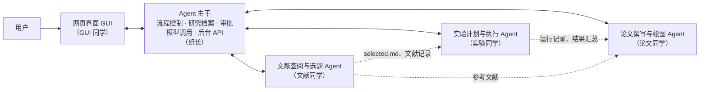

# AI Researcher Agent：项目说明与分工

**写给：** Group 6 全体成员  
**日期：** 2026-10-07  
**阅读时间：** 约 15 分钟  
**相关文档：** 《需求分析》

这份文档不需要任何软件开发或 Agent 开发背景。读完后你应该知道：我们在做什么、系统由哪几块组成、你负责哪一块、这三周每周要交出什么。

---

## 1. 我们要做什么

**一句话：** 做一个“AI 科研助手”。用户给出一个研究想法，它会查文献、确定研究问题，设计并运行实验，最后写出一篇 LaTeX 论文。论文里的每个重要结论都能追溯到具体是哪次实验得出的。

### 1.1 用一个例子走一遍

> 用户输入：“研究小型文本分类模型在数据很少时，哪种微调方法更好。用公开数据集，一张 GPU，6 小时以内。”

1. **查文献、定题目。** 助手搜索相关论文，派几个“阅读员”分头读，整理出已有工作做了什么、还缺什么，再把题目收窄成一个具体可做的研究问题。用户确认后保存为 `selected.md`。
2. **设计实验。** 助手写出实验计划：和哪个基线比、改变哪些变量、用什么指标、每组跑几次、什么时候停。用户批准后才开始跑。
3. **写代码、跑实验。** 助手写实验代码，先小规模试跑，没问题再正式运行。每次运行的代码、配置、日志、结果都保存下来。出错时有限次地自己修复，修不好就停下来问用户。
4. **看结果、决定下一步。** 结果不稳定就提议复现，预算用完就停，不会为了得到“好看的结果”无限地试下去。
5. **画图、写论文。** 用真实结果画图，按用户上传的 LaTeX 模板写论文并编译成 PDF。
6. **自动检查论文。** 逐条检查论文里的结论和数字，看是否真的有实验支持、数字是否和记录一致。用户批准最终稿后项目完成。

### 1.2 我们的研究贡献是什么

只把“搜论文 + 写代码 + 写论文”串起来，已经有人做过（例如 The AI Scientist），作为课程项目贡献不够。我们的重点是：

> **论文里的结论到底有没有证据？**

我们会给系统加一个“论断-证据检查”：每条结论都必须指向具体的实验运行、指标和图表，检查不过就标出来。然后做对照实验：**同一个系统，开着这个检查和关掉这个检查，写出来的论文里无依据的结论会不会更少？** 不管结果是“有用”还是“没用”，都是有效的结论。

课程评价按三方面同等看待：**端到端体验**（能不能顺畅用完一遍）、**Agent 能力**（有没有真本事）、**严格的实验比较**（对照实验做得是否规范）。所以每个人除了开发，也都要承担一部分评价工作（见第 4 节）。

---

## 2. 先弄懂几个概念

| 概念 | 大白话解释 |
|---|---|
| **大模型（LLM）** | GPT、Claude 这类模型。给它一段文字，它回一段文字。我们通过代码调用它。 |
| **Agent** | 让大模型循环干活：看当前情况 → 决定下一步 → 调用工具 → 看工具返回的结果 → 再决定下一步。系统里有好几个这样的 Agent，分别负责不同阶段。 |
| **提示词（Prompt）** | 给大模型的任务说明，例如“你是一名论文阅读员，请从下面的论文中提取实验设置，按以下 JSON 格式输出……”。写好提示词、规定好输出格式，是每个阶段的核心工作之一。 |
| **工具（Tool）** | 一个普通的 Python 函数，例如“搜索论文”、“保存文件”、“运行实验脚本”。Agent 想做事时，就请求调用某个工具。 |
| **Skill** | 一套可复用的“做事说明书”，例如“如何画规范的科研图”。它包括文字说明、模板或脚本，以及检查规则，Agent 做这类事时会加载它。 |
| **研究档案** | 每个研究项目对应一个文件夹，所有东西都存在里面，并且记录版本：改一次就多一个版本，旧版本保留。 |
| **审批** | 关键节点要等用户点“批准”才能继续，包括 idea、实验计划、重要过程日志和最终论文。 |
| **追溯链** | 论文里的一个数字 → 来自哪张图表 → 由哪几次实验运行算出 → 用的是哪份代码和配置。 |
| **后台 / API / 前端** | 后台是一直在电脑上运行的程序，真正干活的都在这里；API 是后台对外提供的“接口菜单”；前端（GUI）是浏览器里的页面，它通过 API 让后台干活、取回数据显示出来。 |

---

## 3. 系统长什么样

- **主干**像一个“项目经理 + 档案室”：决定现在进行到哪个阶段，什么时候等用户批准，钱和时间用了多少；所有文件都通过它保存。
- **三个阶段 Agent** 各干一段研究工作。它们不直接互相调用，而是通过研究档案里的文件交接（图中虚线）。
- **GUI** 是用户看到的界面。它只负责显示和提交操作，不包含研究逻辑。

这样拆分的好处是：每个人可以基本独立开发自己那块，只要守住**交接文件的格式**（第 5 节）。

---

## 4. 每个人的分工

> 负责人一栏请在第一次组会上填写。工作量已尽量平衡：组长的部分最重，GUI 同学需要从零学前端，学习成本最高，其余三个阶段的工作量相近。

### 4.1 Agent 主干（负责人：ZHU YANG）

**一句话：** 搭好所有人共用的“地基”，让其他同学只需专注写自己阶段的逻辑。

**具体要做：**
- 项目骨架和代码仓库，定好目录结构与开发规范；
- 研究档案：保存和读取文件、版本记录、事件日志；
- 流程控制：决定当前阶段，等待审批，预算超了就暂停，程序中断后能从断点继续；
- 审批：记录哪个版本在等批准；用户批准、退回或拒绝后，流程继续往下走；
- 模型调用入口：所有人都通过同一个函数调用大模型，自动记录用量和花费；
- Skill 加载机制；
- 后台 API：给 GUI 调用；提供 CLI 用于调试；
- **一个“示例阶段”和一个“样例项目文件夹”**：让其他同学照着写，并且在别人的模块还没完成时就能先测试自己的；
- 评价用的“批量运行工具”：能一次跑多个项目，并切换证据检查的开和关；
- 代码评审、每周集成、帮组员解决技术问题。

**评价任务：** 批量运行与用量、成本统计；中断恢复测试。

### 4.2 文献查阅与选题 Agent（负责人：____）

**一句话：** 把用户的模糊想法，变成一个有文献支撑、在预算内能做的具体研究问题。

**具体要做：**
- 接入一个论文检索服务（具体用哪个第一周定），按关键词搜论文，保存标题、作者、年份、链接、摘要和检索时间；
- **多 Agent 协作阅读（项目亮点之一）**：协调者把论文分给不同角色的“阅读员”。“方法阅读员”提取方法和实验设置，“差距分析员”找出还没解决的问题，“可行性阅读员”判断代码、数据和算力需求。最后合并结果，冲突的地方标出来；
- 为 idea 的新颖性、可行性、风险打分，每项写明理由和对应的文献；
- 生成 `selected.md`（研究问题、假设、基线、指标、预算……）和文献证据表；
- 给论文同学提供“引用核验”：确认论文里引用的文献确实存在于文献记录中。

**要特别注意：** 绝不能编造引用；只读到摘要的论文要标注“仅基于摘要”。

**评价任务：** 对比“一个 Agent 读”和“多个角色分工读”在覆盖率、准确性和花费上的差别；测试网页里藏有恶意指令时，系统能否不受影响。

### 4.3 实验计划与执行 Agent（负责人：____）

**一句话：** 把研究问题变成实验计划，让 Agent 写代码、在本机跑实验、分析结果、决定下一步。

**具体要做：**
- **第一周牵头选定演示任务**（建议选一个规模小的 NLP 任务，几十分钟内能跑完一轮），并手写一个能跑的基线实验作为模板；
- 根据 `selected.md` 生成实验计划：基线、主要方法、对照或消融、变量、指标、重复次数、停止条件；
- 让 Agent 在模板基础上写或修改实验代码；
- **本地执行**：先试跑，再正式运行；保存日志、错误、指标和运行环境信息；出错后有限次自动修复，超过次数就停下请用户决定。每次运行有唯一编号，失败的运行也要保存，不能覆盖；
- 用固定脚本汇总结果（求平均、标准差等），**大模型不能直接改结果数字**；
- 分析结果，决定继续、复现、修改计划还是停止；需要改计划时提交给用户审批；
- 准备一个简单的非 NLP 任务配置，证明系统不只能做 NLP（第三周视时间而定）。

**评价任务：** 统计实验能力指标（首次运行成功率、出错后恢复的比例等）；用一个项目实例先跑一遍，估算一次完整运行的花费。

### 4.4 论文撰写与绘图 Agent（负责人：____）

**一句话：** 用真实实验结果画图、写论文，并检查论文里的每个结论都有证据。**本项目的核心贡献在这里。**

**具体要做：**
- **绘图 skill**：根据汇总结果用 matplotlib 生成规范的科研图（坐标轴标签、单位、误差条），绘图脚本和数据一起保存；
- **LaTeX 写作 skill**：按用户上传的模板（没有就用默认模板）生成论文并编译；编译错误、缺失的引用和图都要报告出来；
- **论断-证据矩阵**：先列出论文要提出的结论，每条结论绑定实验编号、指标和图表，再据此写正文；
- **自动核验（claim-review）**：逐条检查数字是否与实验记录一致、结论有没有说过头（例如把相关性写成因果）、引用是否有效；
- 写论文时把“观察到的结果”和“对结果的解释”分开写。

**评价任务：** 牵头设计主对照实验（证据检查开 vs. 关）：定义“无依据结论率”等指标，制定人工评分标准，组织盲评；另外负责在干净的环境里复现核心实验。

### 4.5 GUI 开发（负责人：____）

**一句话：** 做一个浏览器里的网页界面，让用户不用敲命令就能完成整个研究流程。

**技术：** React 或 Vue，第一周由你选定。建议搭配现成的组件库（React 用 Ant Design，Vue 用 Element Plus），按钮、表格、表单都能直接用，不用自己写样式。

**需要的页面：**
- 项目创建：输入研究想法和预算，上传 LaTeX 模板；
- 项目状态：当前阶段、进度、预算消耗、卡在哪里；
- 审批列表：查看 idea、实验计划、重要过程日志、最终论文，可以批准、退回或拒绝，并显示与上一版的差异；
- 运行查看：实验列表、实时日志、暂停或取消；
- 产物查看：文献摘要、图表、论文 PDF 预览，**点击论文中的结论能跳到对应的实验记录**；
- 导出：下载 LaTeX 源文件、图和 PDF。

**怎么开始：** 主干会提供 API 说明页（后台自动生成，浏览器里能直接试用每个接口）。第一周先用假数据把页面做出来，第二周再接真实接口。关掉网页不能影响后台正在跑的实验，这一点由后台保证，你只需要在打开页面时重新读取状态。

**评价任务：** 负责端到端演示：用 GUI 完整走一遍流程并录屏；逐条验收需求分析第 12 节的场景清单；作为两名盲评员之一。

### 4.6 交叉任务

有些检查必须由“没写这部分代码的人”来做，才算公平：

| 任务 | 谁来做 |
|---|---|
| 对照实验的论文盲评（两人各自独立打分） | GUI 同学、文献同学 |
| 在干净环境复现核心实验 | 论文同学 |
| 代码评审 | 组长评审所有人；组员两两互看，主要检查“能不能看懂” |

---

## 5. 大家怎么配合

### 5.1 交接文件（最重要）

各模块之间通过研究档案里的文件交接。**这些文件的格式在第一周一起定下来，之后不随便改**，要改必须通知相关的人。

| 交接物 | 谁产出 | 谁使用 |
|---|---|---|
| `idea/selected.md`：研究问题、假设、基线、指标、预算 | 文献同学 | 实验同学、论文同学 |
| `idea/literature.jsonl`：文献记录 | 文献同学 | 论文同学（参考文献、引用核验）、GUI |
| `plan/experiment_plan.md`：实验计划 | 实验同学 | 论文同学、GUI |
| `runs/<运行编号>/`：日志、指标、状态、环境信息 | 实验同学 | 论文同学、GUI |
| `artifacts/`：结果汇总表 | 实验同学 | 论文同学 |
| `paper/`：LaTeX、PDF、`claims.jsonl`（论断-证据矩阵） | 论文同学 | GUI |
| 审批、项目状态、预算 | 主干 | 所有人、GUI |

### 5.2 不用等别人

- 组长会在第一周提供一个**手工做好的样例项目文件夹**，里面有假的 `selected.md`、几次假的运行记录和汇总表。论文同学和 GUI 同学可以先拿它开发，不用等实验真正跑出来。
- 每个阶段 Agent 都能单独运行和测试，不必等整个系统完成。

### 5.3 日常规则

- **Git：** 每人在自己的分支上开发，完成一个小功能就提交 Pull Request，评审后再合并。不要直接改别人负责的文件。
- **AI 编程助手：** 鼓励使用（如 Claude Code、Copilot），但提交前要自己读懂代码，评审时要能讲清楚它在做什么。
- **密钥安全：** 大模型的 API Key 只放在本地的环境变量里，**绝不提交到 Git**。

### 5.4 建议先学的东西

| 谁 | 学什么 |
|---|---|
| 所有人 | Git 基本操作（clone、branch、commit、push、Pull Request）；Python 基础；如何用代码调用大模型 API 并让它按 JSON 格式输出 |
| 文献同学 | 论文检索 API 的基本用法；JSON 数据处理 |
| 实验同学 | 用 Python 运行外部命令并保存输出（subprocess）；演示任务相关的实验代码 |
| 论文同学 | LaTeX 与 BibTeX；matplotlib |
| GUI 同学 | 所选框架（React 或 Vue）的官方入门教程；组件库用法；在前端调用后台接口（fetch / axios） |

---

## 6. 三周计划

**目标：** 第二周结束前跑通一次完整流程，第三周专心做评价和交付。

| | 第 1 周：打地基 | 第 2 周：连起来 | 第 3 周：评价与交付 |
|---|---|---|---|
| **组长** | 项目骨架、研究档案、模型调用入口、示例阶段、样例项目；组织大家定交接格式 | 流程控制、审批、后台 API；周中第一次全流程联调，用命令行跑通 | 批量运行工具；跑对照实验；修复问题；整合报告 |
| **文献同学** | 输入研究问题 → 检索 10~20 篇论文 → 保存文献记录 | 多角色阅读与合并、idea 评分、生成 `selected.md`、引用核验 | 单 Agent 与多 Agent 对比；提示注入测试；盲评；写报告相应章节 |
| **实验同学** | 选定演示任务；手写一个能跑的基线；实现本地运行并保存记录 | 实验计划生成、Agent 写代码、试跑与修复、结果汇总、分析决策 | 成本试跑；实验能力指标；非 NLP 配置（视时间而定）；写报告相应章节 |
| **论文同学** | 用样例项目画图，生成 LaTeX 并编译成功 | 论断-证据矩阵、自动核验、用户模板 | 设计对照指标和评分标准、组织盲评、复现核心实验；写报告相应章节 |
| **GUI 同学** | 学框架；用假数据做出项目状态页、审批列表 | 接真实 API；运行日志、产物查看、PDF 预览、证据跳转 | 端到端演示录屏；场景验收；盲评；写报告相应章节 |

**第二周周末的检查点：** 用 GUI 从输入研究想法开始，经过两次审批，跑完至少一个基线和一个对比实验，得到一篇能编译的论文草稿。如果到时还没跑通，第三周第一天全员一起修主流程，其他功能暂停。

### 6.1 因时间有限而推迟或简化的内容

| 内容 | 处理 | 说明 |
|---|---|---|
| SSH 远程服务器执行 | **推迟**，只做本地执行 | 需求分析和 proposal 都把它列为必须项，最终报告中要说明这是已知限制 |
| 从一个领域自动生成多个候选 idea | 不做，只完善用户给出的 idea | 需求中本就是增强项 |
| 对照实验规模（原计划 18 次 Agent 运行） | 先试跑一次估算花费，再定实际次数 | 报告中如实说明样本量有限 |
| 非 NLP 迁移检查 | 第三周有时间再做 | |
| GUI 中的计划版本差异对比 | 能做就做，做不了就显示两个版本的全文 | |

