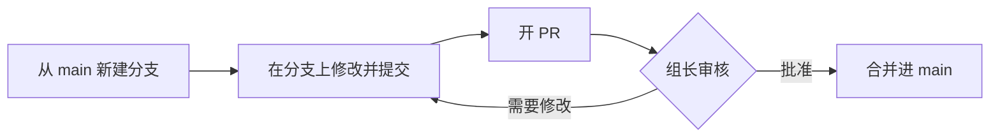

# 如何提交 PR：给组员的操作说明

**写给：** Group 6 全体成员  
**日期：** 2026-10-07  
**阅读时间：** 约 10 分钟  
**仓库地址：** https://github.com/sunnyoung0211/ai-researcher-agent

这份说明不需要任何 Git 基础。读完后你应该知道：怎么把自己的修改交上来、交上来之后会发生什么、被要求修改时怎么办。

---

## 1. 先弄懂几个概念

| 概念 | 大白话解释 |
|---|---|
| **仓库（Repo）** | 项目的共享文件夹，放在 GitHub 上。所有文档和代码都在这里，并且记录每一次修改。 |
| **`main` 分支** | 仓库的“正式版”。大家看到、用到的都是它。**任何人都不能直接改 `main`**，GitHub 会拒绝。 |
| **分支（Branch）** | 从 `main` 复制出来的一份“草稿”。你在自己的分支上随便改，不会影响别人。 |
| **提交（Commit）** | 保存一次修改，并写一句话说明改了什么。一个分支上可以有多次提交。 |
| **PR（Pull Request）** | “请把我分支上的修改合并进 `main`”的申请。组长看过、批准后才会合并。 |
| **审核（Review）** | 组长看你的 PR，可能直接批准，也可能留言请你修改。 |
| **合并（Merge）** | PR 被批准后，修改正式进入 `main`。 |

整个流程就是：



---

## 2. 第一次使用前（只做一次）

1. **注册 GitHub 账号**：如果还没有，到 https://github.com 注册。
2. **把用户名发给组长**，组长会邀请你加入仓库。
3. **接受邀请**：你会收到一封 GitHub 邮件，点里面的 **Accept invitation**。也可以直接打开仓库地址，页面顶部会有接受邀请的提示。

接受之后，你就可以开分支、开 PR 了。

---

## 3. 方法 A：直接在网页上改（推荐，不用装任何软件）

**适合：** 修改或新增文档（`.md` 文件），改动不多的时候。

### 3.1 修改已有文件

1. 打开仓库页面，点进你要改的文件，例如 `docs/AI_Researcher_Agent_需求分析.md`。
2. 点右上角的 **铅笔图标 ✏️**（Edit this file）。
3. 直接在网页里修改。可以点上方的 **Preview** 看排版效果。
4. 改完后点右上角绿色的 **Commit changes...**，会弹出一个窗口：
   - **Commit message**：用一句话写清楚改了什么，例如 `补充需求分析中的评价指标`。
   - 因为 `main` 受保护，下面会默认选中 **Create a new branch for this commit and start a pull request**。分支名可以用默认的，也可以改成好懂的名字（见第 5 节）。
5. 点 **Propose changes**。
6. 进入“开 PR”页面，按第 6 节填好标题和说明，点 **Create pull request**。

完成。接下来等组长审核。

### 3.2 新增文件

1. 在仓库页面进入目标文件夹（例如 `docs/`）。
2. 点右上角 **Add file** → **Create new file**（新写一个），或 **Upload files**（上传电脑里已有的文件）。
3. 填文件名、写内容或拖入文件，后面的步骤和 3.1 的第 4–6 步一样。

### 3.3 一个 PR 里改多个文件

上面的方法每保存一次就会开一个新 PR。如果你想在**同一个 PR** 里改好几个文件：

1. 第一个文件按 3.1 做完，开好 PR。
2. 回到仓库首页，点左上角的分支下拉框（默认显示 `main`），**切换到你刚才的分支**。
3. 在这个分支上继续改其他文件。点 **Commit changes...** 时选择 **Commit directly to the `你的分支名` branch**。
4. 这些修改会自动出现在同一个 PR 里。

---

## 4. 方法 B：用命令行（写代码的同学用）

**适合：** 修改代码、一次改很多文件、需要在本地运行和测试的时候。

### 4.1 第一次：下载仓库并设置身份

打开终端（Mac 用“终端”App，Windows 用 Git Bash），依次运行：

```bash
git clone https://github.com/sunnyoung0211/ai-researcher-agent.git
cd ai-researcher-agent
git config --global user.name "你的GitHub用户名"
git config --global user.email "你注册GitHub的邮箱"
```

### 4.2 每次开始一项新任务

```bash
git checkout main
git pull
git checkout -b 分支名
```

- `git pull`：先把 `main` 更新到最新，避免基于旧版本修改。
- `git checkout -b 分支名`：新建一个分支并切换过去，分支名见第 5 节。

然后正常修改文件。

### 4.3 保存修改并推送到 GitHub

```bash
git add .
git commit -m "用一句话说明改了什么"
git push -u origin 分支名
```

**第一次推送时**，终端会要求登录：

- **Username**：填 GitHub 用户名（不是邮箱）。
- **Password**：**不是 GitHub 密码**，要填一个访问令牌（token）：
  1. 打开 https://github.com/settings/tokens → **Generate new token (classic)**
  2. 勾选 **repo**，有效期选 90 天
  3. 生成后复制 `ghp_` 开头的那串字符，粘贴到 Password 处，按回车。粘贴时屏幕上不显示任何字符，这是正常的。

Mac 会自动记住令牌，以后不用再输入。

### 4.4 开 PR

推送成功后，打开仓库页面，顶部会出现黄色提示条，点 **Compare & pull request**，按第 6 节填好内容，点 **Create pull request**。

---

## 5. 分支怎么命名

格式：`类型/简短描述`，用英文小写，单词之间用 `-` 连接。

| 类型 | 用途 | 例子 |
|---|---|---|
| `docs/` | 改文档 | `docs/update-requirements` |
| `feat/` | 新功能 | `feat/literature-search` |
| `fix/` | 修 bug | `fix/pdf-compile-error` |
| `eval/` | 评价、实验相关 | `eval/claim-check-baseline` |

**一个分支只做一件事。** 两件不相关的事就开两个分支、两个 PR，审核起来更快。

---

## 6. PR 的标题和说明怎么写

**标题**：一句话说清楚这个 PR 做了什么，例如 `补充需求分析中的评价指标`。

**说明**：复制下面的模板，填空即可。

```markdown
## 改了什么
- （列出主要改动，例如：在第 3 节新增了 3 个评价指标）

## 为什么改
- （例如：上周讨论决定增加论断准确率指标）

## 需要组长特别看的地方
- （没有就写“无”）
```

右侧的 **Reviewers** 选组长 `sunnyoung0211`，组长会收到通知。

---

## 7. 提交之后会发生什么

0. **自动检查（CI）。** 开 PR 后几分钟内，PR 页面底部会出现一组自动检查：在 Mac、Windows、Linux 上分别跑全部测试，再检查代码格式。
   - 全部显示绿色 ✓：很好，等组长审核；
   - 有红色 ✗：点该项右边的 **Details** 看出错信息（通常最后几行写着哪个测试失败、为什么）。在同一个分支上修好再提交，检查会自动重跑。看不懂就在 PR 里留言请组长帮忙；
   - 只改了文档（`.md` 文件）一般不会影响检查结果。
1. **组长审核。** 你会收到 GitHub 邮件通知。
2. **如果组长批准**：组长会点合并，你的修改就进入 `main` 了，不需要你再做什么。
3. **如果组长留言请你修改**：
   - 在 PR 页面的 **Files changed** 或 **Conversation** 标签里看留言。
   - **在同一个分支上**继续修改并提交，不要新开 PR：
     - 网页方式：切换到你的分支（见 3.3），修改文件，选 **Commit directly to the `你的分支名` branch**。
     - 命令行方式：直接改文件，然后再运行一遍 4.3 的三条命令，`git push` 时不用再加 `-u origin 分支名`。
   - 新的提交会自动出现在原来的 PR 里。
   - 每条留言处理完后，点留言下方的 **Resolve conversation**。**所有留言都 Resolve 之后 PR 才能合并。**
   - PR 获批后如果你又推了新的修改，需要组长**重新批准**。

### 合并之后（命令行用户）

回到 `main` 并更新，准备做下一项任务：

```bash
git checkout main
git pull
```

---

## 8. 常见问题

**Q：推送时提示 `protected branch` 或 `push declined`，被拒绝了？**  
A：说明你在 `main` 上直接改了。命令行用户先运行 `git checkout -b 新分支名`，把修改带到新分支，再从 4.3 开始。网页用户在保存时选 **Create a new branch**。

**Q：PR 页面提示 `This branch has conflicts`（有冲突）？**  
A：说明你和别人改了同一个地方。**不要自己硬改**，在 PR 里留言或者直接找组长，组长会帮你处理。

**Q：改错了，想撤回？**  
A：PR 还没合并的话，直接在分支上再改回来、再提交一次就行。如果整个 PR 都不要了，在 PR 页面底部点 **Close pull request**。

**Q：可以批准别人的 PR 吗？**  
A：可以，欢迎互相看。但需要组长批准后才能合并。

---

## 9. 千万不要提交的东西

- **API 密钥、密码、令牌**：例如 OpenAI / Anthropic 的 key，以及 `.env` 文件。仓库是公开的，任何人都能看到。一旦提交，即使之后删掉，也要立刻去对应网站作废这个 key。
- **很大的文件**：数据集、模型权重、超过 50 MB 的文件。放在网盘里，在文档中写链接。
- **电脑自动生成的文件**：例如 `.DS_Store`、`__pycache__/`、LaTeX 的 `.aux` / `.log`。仓库已经设置自动忽略这些文件，正常操作不用管。

有任何不确定的地方，先问组长再提交。
