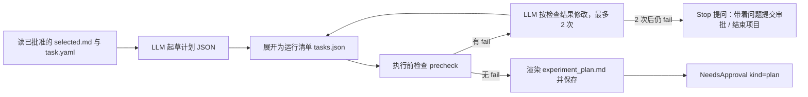

# 详细设计 3：实验计划与执行 Agent

**文档版本：** v0.1  
**编写日期：** 2026-10-08  
**负责人：** ____（实验同学）  
**依据：** 《需求分析》v1.3、《概要设计》v0.2、《详细设计 1：Agent 主干》、《详细设计 2：文献查阅与选题》  
**读者：** 实验同学（实现）；论文同学（读第 5、8 节和第 11 节）；主干（读第 6 节核对接口）；GUI 同学（读第 5 节和第 12 节）

---

## 0. 先读这一段

你负责的是研究循环里“动手”的部分：**把研究问题变成实验计划 → 写代码 → 在本机跑 → 汇总结果 → 决定下一步**。

这里有两个原则贯穿全文，遇到拿不准的设计都可以回到这两条：

1. **能用确定性代码做的，就不让大模型做。** 计划展开成运行清单、生成配置文件、汇总平均值和标准差、判断是否超预算——全是普通代码。大模型只负责“需要理解和判断”的部分：起草计划、修改实验代码、解释结果、建议下一步。
2. **原始结果只能由运行包装器写，任何人（包括大模型）都不能改。** 这是论文证据可信的基础。

你要写的代码分三块，可以按顺序做：

| 块 | 第几周 | 不依赖大模型？ |
|---|---|---|
| A. 演示任务 + 运行包装器 + 本地执行器 | 第 1 周 | 是，纯 Python |
| B. 计划生成 + 编码 Agent + 修复重试 | 第 2 周 | 否 |
| C. 结果汇总 + 分析决策 | 第 2 周 | 汇总是，决策否 |

---

## 1. 范围

### 1.1 负责的需求

| 需求 | 本文落点 |
|---|---|
| FR-20、21、22 实验计划、成功/失败/停止条件、任务清单 | 第 4 节 |
| FR-23 执行前检查（许可、泄漏、指标、公平） | 4.5 |
| FR-24 信息量更高的下一轮实验（S） | 9.4 |
| FR-25 根据计划生成/修改代码 | 第 7 节 |
| FR-26、27、28 隔离运行、静态检查与试运行、环境归档 | 第 5、6 节 |
| FR-29 区分基线/主要方法/消融/复现 | 4.2 `kind` |
| FR-30 失败恢复和有限重试 | 7.4 |
| FR-31 查看状态、取消运行 | 6.4 |
| FR-32 汇总、方差、成本、失败率 | 第 8 节 |
| FR-34、35、36 结果解释边界、意外结果、每轮报告与决策 | 第 9 节 |
| FR-37 人工标注运行（S） | 8.4 |
| FR-62（本地）环境与输入可归档核对 | 5.5 |
| 8.1 非 NLP 迁移检查（视时间） | 第 13 节 |

### 1.2 本期不做

- SSH 远程执行（FR-60、61）。`Executor` 接口按本地/远程通用设计，以后加 `SSHExecutor` 不需要改阶段代码。
- 自动安装依赖。缺依赖时停下来请用户安装（安全要求：不执行未知安装命令）。
- 同时使用多块 GPU。GPU 运行串行。

---

## 2. 代码位置

```text
airesearcher/
├── stages/plan/                  # 计划阶段（PlanDrafting 状态）——若组会决定交给文献同学，整个目录移交
│   ├── stage.py
│   ├── expand.py                 # 计划 → 运行清单（确定性）
│   ├── precheck.py               # 执行前检查（确定性）
│   ├── render.py                 # ExperimentPlan → experiment_plan.md
│   └── prompts/
├── stages/experiment/            # 实验阶段（Executing / Analyzing 状态）
│   ├── stage.py
│   ├── coder.py                  # 编码 Agent（基于主干的 tool_loop）
│   ├── repair.py                 # 错误分类与修复策略
│   ├── aggregate.py              # 结果汇总（确定性）
│   ├── analysis.py               # 异常检查 + 分析决策
│   └── prompts/
├── runtime/
│   ├── executor.py               # Executor 协议、RunSpec 等
│   ├── local.py                  # LocalExecutor
│   ├── wrapper.py                # 运行包装器（独立进程）
│   └── envsnap.py                # 环境快照
├── services/runs.py              # 给论文阶段和 API 读运行与汇总结果
└── core/models/{plan,run,aggregate}.py   # 你起草
tasks/
├── text_cls_lowres/              # 主演示任务
├── smoke/                        # 60 秒的冒烟任务（主干的测试要用）
└── cache_policy_sim/             # 非 NLP 迁移检查（第 3 周，视时间）
skills/experiment-planning/
```

---

## 3. 演示任务与任务配置

### 3.1 演示任务（第 1 周你来定，以下是建议）

**低资源文本分类：在 SST-2 的小训练子集上比较三种方法。**

| 项 | 建议 |
|---|---|
| 数据 | SST-2（HuggingFace `stanfordnlp/sst2`）。GLUE 的 test 划分没有公开标签，所以：从 train 中抽样作训练集，从 train 剩余部分另划 1,000 条作 **dev（调参用）**，官方 validation（872 条）作 **最终测试集** |
| 训练规模 | 每次运行从 train 抽 100 / 500 / 1000 条（自变量） |
| 方法 | B2：TF-IDF + 逻辑回归（秒级，CPU）；B1：小型 Transformer 全量微调；M1：同一模型 + LoRA（`peft` 库） |
| 模型 | `distilbert-base-uncased` 或更小的模型（如 `prajjwal1/bert-small`），按你的电脑速度选，保证单次运行 ≤ 5 分钟 |
| 指标 | accuracy（主要）、macro-F1、训练耗时 |
| 种子 | 每个组合 3 个 |
| 规模估算 | 3 方法 × 3 规模 × 3 种子 = 27 次运行；TF-IDF 几乎不耗时，其余 18 次 × 约 4 分钟 ≈ 1.2 小时 |

**为什么这样选：** 跑得快（一轮几十分钟）、不一定需要 GPU、有明确的基线和消融（LoRA rank 4 vs 16 可作消融）、低资源下方差大，正好能触发“结果不稳定 → 复现”的决策演示。

第 1 周手写一个能跑的完整模板（第 3.3 节），这是编码 Agent 的起点，也是最重要的第 1 周产出。

### 3.2 任务配置 `tasks/<name>/task.yaml`

**主流程只读这个文件来了解领域**，不出现任何 NLP 专有字段（概要设计 D8）。

```yaml
name: text_cls_lowres
domain: nlp
description: 低资源文本分类（SST-2 训练子集）
template_dir: tasks/text_cls_lowres/template      # 计划获批后复制到项目 src/
entrypoint: ["{python}", "run.py", "--config", "{config}", "--out", "{out_dir}"]   # 占位符见下方说明
trial_args: ["--trial"]                           # 试运行时追加：只用 50 条数据、1 个 epoch
config_schema: tasks/text_cls_lowres/config_schema.json   # JSON Schema：配置里允许哪些字段、取值范围
metrics:
  - {name: accuracy,      direction: higher, required: true}
  - {name: macro_f1,      direction: higher, required: true}
  - {name: train_seconds, direction: lower,  required: false}
splits:                                           # 划分名 → 用途
  train: {role: train}
  dev:   {role: explore}                          # 调参、选模型只能用它
  test:  {role: final}                            # 只用于最终评价
data:
  - name: sst2
    source: huggingface:stanfordnlp/sst2
    license: 见 https://huggingface.co/datasets/stanfordnlp/sst2 （第 1 周核实后填写）
    prepare: ["{python}", "tasks/text_cls_lowres/prepare_data.py", "--out", "{data_dir}"]   # 下载并划分（3.5）
    files:                                        # prepare 后的文件及校验值（相对 {data_dir}）
      - {path: train.jsonl, sha256: "..."}
      - {path: dev.jsonl,   sha256: "..."}
      - {path: test.jsonl,  sha256: "..."}
models:                                           # 需要预先下载的预训练模型（3.5），运行时离线使用
  - distilbert-base-uncased
methods_available: [tfidf_lr, full_ft, lora]      # 模板已支持的方法
semantic_keys: [method, model_name, train_size, eval_split, lora_rank]   # 修复时不许改的配置项（7.5）
repair_tunable: [batch_size, grad_accum_steps]    # OOM 时允许调整的配置项
protected_files: [air_report.py, data.py, evaluate.py]   # 编码 Agent 不能改的文件
sanity:                                           # 异常检查阈值（9.2）
  accuracy: {max_expected: 0.97}
  max_gain_over_baseline: 0.15
resources: {est_minutes_per_run: 4, gpu: optional}
```

**占位符：** `{python}` = `project.yaml` 的 `experiment.python`，为空时取后台自身的 Python 解释器（`sys.executable`），实验依赖（torch、transformers、peft）需要装在这个解释器的环境里；`{data_dir}` = `${AIR_HOME}/data/<data.name>`；`{config}`、`{out_dir}` = 运行目录下的 `config.yaml` 和 `outputs/`。

### 3.3 实验模板 `tasks/text_cls_lowres/template/`

```text
template/
├── run.py            # 入口：读配置 → 准备数据 → 按 method 训练 → 在 eval_split 上评价 → 报告指标
├── data.py           # 从环境变量 AIR_DATA_DIR 指向的目录读数据，按 seed 抽训练子集（受保护）
├── evaluate.py       # 计算 accuracy、macro-F1（受保护）
├── methods/
│   ├── tfidf_lr.py
│   ├── full_ft.py
│   └── lora.py
├── air_report.py     # 指标上报（受保护，见 5.3）
└── requirements.txt
```

`evaluate.py` 和 `data.py` 受保护的原因：评价方式和数据划分一旦能被编码 Agent 修改，就可能出现“改评价代码让结果变好”的情况。

### 3.4 冒烟任务 `tasks/smoke/`

一个只用标准库的脚本：读配置中的 `seconds`（默认 60）和 `fail_mode`（`none | exit1 | hang | no_metrics`），按时上报一个随机指标后退出。没有 `data` 和 `models`，不需要准备数据。主干的恢复测试和所有人的单元测试都用它，**第 1 周就要交付**。

### 3.5 数据与模型准备（`runtime/data.py`）

数据集和预训练模型放在所有项目共用的 `${AIR_HOME}/data/` 下（主干已把它加入写权限白名单），只准备一次。

```python
ensure_data(ctx, task) -> DataStatus    # 计划阶段（执行前检查之前）和实验阶段 setup 都调用
```

1. 对 `task.yaml` 中的每个数据集：文件都存在且 sha256 与记录一致 → 通过；
2. 文件缺失 → 用 `{python}` 运行 `prepare` 命令（先 `permissions.guard("exec", "local")`；下载需要的域名已在网络白名单中），输出写到 `environments/prepare_<name>.log`，超时 `experiment.prepare_timeout_s`（默认 30 分钟）。用 `${AIR_HOME}/data/<name>/.lock` 文件锁，避免两个项目同时准备同一份数据；
3. `models` 中的预训练模型下载到 `${AIR_HOME}/data/hf_cache/`。之后每次运行，包装器设置 `HF_HOME=${AIR_HOME}/data/hf_cache`、`HF_HUB_OFFLINE=1`：**实验运行时不联网**，结果不受远端模型更新影响；
4. 准备完成后再校验 sha256。**校验值的记录**：`task.yaml` 中的值是参考值；本项目实际使用的值写入 `environments/data_checksums.json`，执行器的 `prepare()` 和环境快照都以它为准；
5. 出问题时提问（主干详细设计 3.7），而不是直接失败：

| 情况 | 问题 | 选项 |
|---|---|---|
| `prepare` 命令失败或超时 | “数据集 sst2 准备失败，日志见 …” | `retry`：我已检查网络/磁盘，重试；`end`：结束项目 |
| 准备后的校验值与 `task.yaml` 不同（上游数据有更新） | “sst2 的文件与任务配置记录的版本不一致” | `accept`：接受新版本（写入 `data_checksums.json` 并记事件，报告中说明）；`end` |

两个问题都没有默认选项：评价批量运行前要先在本机准备好数据。

---

## 4. 计划阶段（`stages/plan/`，PlanDrafting 状态）

### 4.1 流程



- 开始前先调用 `ensure_data()`（3.5），因为执行前检查中的泄漏检查要读取数据；
- 输入：`parse_selected_md(ctx.archive.read_text(ctx.approved["idea"]))`、`project.yaml` 中 `task` 指向的 `task.yaml`、`project.yaml` 的预算与 `limits`；被退回时还有 `ctx.feedback`；从分析阶段退回时有 `ctx.entry`（过程日志和修订建议）；idea 变更后有 `ctx.stale`。
- 起草用 strong 模型，加载 `experiment-planning` skill（其 `SKILL.md` 写清计划规则：每个假设至少对应一个比较；基线与方法使用相同的数据规模、种子数和调参次数；调参只能用 `explore` 划分；必须写停止条件）。

### 4.2 计划格式 `plan/experiment_plan.md`（第 1 周末冻结）

与 `selected.md` 一样：YAML 区块给程序，正文给人；两者由同一份 `ExperimentPlan` 数据渲染。

```yaml
---
plan_id: plan-001
idea_ref: {artifact_id: idea/selected.md, version: 2, sha256: "…"}
task_config: tasks/text_cls_lowres
experiments:
  - id: E1
    kind: baseline            # baseline | main | ablation | control | replication | exploration
    purpose: 全量微调基线
    hypotheses: [H1]
    method: full_ft
    variables: {train_size: [100, 500, 1000]}
    fixed: {model_name: distilbert-base-uncased, epochs: 5, lr: 3.0e-5, eval_split: test}
    seeds: [0, 1, 2]
    eval_condition: final     # explore | final
    depends_on: []
    target_env: local
    needs_code: false         # 模板已支持则为 false，不需要编码 Agent
    est_minutes_per_run: 4
    success_criteria: 所有组合 3 个种子均完成
    failure_criteria: 任一组合连续 2 次修复后仍失败
  - id: E2
    kind: main
    purpose: LoRA 与全量微调比较
    hypotheses: [H1]
    method: lora
    variables: {train_size: [100, 500, 1000]}
    fixed: {model_name: distilbert-base-uncased, epochs: 5, lr: 3.0e-4, lora_rank: 8, eval_split: test}
    seeds: [0, 1, 2]
    eval_condition: final
    depends_on: []
    needs_code: false
    est_minutes_per_run: 3
  - id: E3
    kind: ablation
    purpose: LoRA rank 的影响
    hypotheses: [H2]
    method: lora
    variables: {lora_rank: [4, 16]}
    fixed: {train_size: 500, …}
    seeds: [0, 1, 2]
    eval_condition: final
    depends_on: [E2]
comparisons:                  # 论文和汇总都按这里分组
  - id: C1
    question: LoRA 是否不低于全量微调
    experiments: [E1, E2]
    group_by: [method, train_size]
    metric: accuracy
  - id: C2
    question: rank 是否重要
    experiments: [E2, E3]
    group_by: [lora_rank]
    metric: accuracy
    filter: {train_size: 500}
replication_policy:           # 计划内允许的复现，用于“结果不稳定”时无需重新审批
  max_extra_seeds_per_group: 3
  trigger: 同组 std > 0.03 或两组 95% 区间重叠且均值差 < 0.01
stopping_conditions:
  max_rounds: 3
  no_progress_rounds: 2
  budget_fraction: 0.9        # 预算用到 90% 停止提交新实验
budget_estimate: {runs: 33, wall_hours: 1.8, gpu_hours: 0}
approval_points: [每轮结束的重要过程日志, 计划外实验, 最终手稿]
---
```

正文章节：目的与假设、实验矩阵（表格）、变量与控制、比较与统计方法、资源估计、停止条件、执行前检查结果、审批点。

对应的数据模型在 `core/models/plan.py`：`ExperimentSpec`、`Comparison`、`ReplicationPolicy`、`ExperimentPlan`，以及 `parse_plan_md(text) -> ExperimentPlan`（论文阶段和 GUI 用它读）。

### 4.3 展开为运行清单 `plan/tasks.json`（FR-22，确定性）

对每个实验，`variables` 做笛卡尔积，再乘 `seeds`，每一项生成一个任务：

```json
{"task_key": "E2-train_size=500-seed=1", "experiment_id": "E2", "kind": "main",
 "config": {"method": "lora", "train_size": 500, "seed": 1, "model_name": "distilbert-base-uncased",
            "epochs": 5, "lr": 0.0003, "lora_rank": 8, "eval_split": "test"},
 "eval_condition": "final", "depends_on": [], "expected_metrics": ["accuracy", "macro_f1"]}
```

每个 `config` 用 `config_schema.json` 校验：字段不认识或取值越界 → 如果 `needs_code: false` 则属于计划错误（交给 LLM 修改计划）；如果 `needs_code: true` 则留给编码 Agent 扩展模板。

### 4.4 实验阶段使用的配置文件

计划获批后，实验阶段把每个任务的 `config` 写成 `configs/<experiment_id>/<task_key>.yaml` 并提交到工作区 git。配置文件由代码生成，不由大模型手写。

### 4.5 执行前检查 `plan/precheck.json`（FR-23）

| 检查 | fail 条件 | warn 条件 |
|---|---|---|
| `license` | — | 某数据集的 `license` 为空或含“未核实” |
| `leakage_split` | `eval_condition: explore` 的实验使用了 `role: final` 的划分；或任何 `exploration` 类实验在 `final` 划分上评价 | — |
| `leakage_data` | 任务提供的 `prepare_data.py --check` 报告 train/dev/test 有重叠样本 | — |
| `metric` | `selected.md` 的主要指标不在 `task.yaml` 的 `metrics` 中 | 次要指标缺失 |
| `fairness` | 同一 comparison 中各实验的 `variables` 取值不同（如基线只跑 2 个规模，方法跑 3 个） | 各方法的种子数或调参组合数不同 |
| `repeats` | — | 主要比较的种子数 < 3 |
| `budget` | 估算总时长 > 预算 × `budget_fraction` | 估算总时长 > 预算 × 0.6 |
| `coverage` | 有假设没有对应任何实验 | — |

结果写入 `plan/precheck.json`（`[{check, status, detail}]`），并在计划正文中列出。warn 项随计划一起交用户审批；fail 项必须先修改计划。模型修改 2 次后仍有 fail 项时提问：`submit_anyway`（把计划连同 fail 项一起提交审批，由用户在审批时判断；批准即视为用户接受该风险，记入事件）/ `end`（结束项目）。没有默认选项。

### 4.6 提交审批

```python
return NeedsApproval(target=plan_ref, kind="plan",
    summary="3 个实验（基线/主方法/消融），33 次运行，估计 1.8 小时；执行前检查 1 项 warn（数据许可未核实）",
    impact="首次提交" ,   # 修订版写：哪些实验变了、已完成的哪些运行不再适用于新计划
    extra_refs=[precheck_ref, tasks_ref])
```

**修订版的规则（需求 6.6）：** 新计划的 `parents` 包含旧计划；旧计划下完成的运行不会被重新解释为新计划的结果——汇总时只使用 `plan_ref` 匹配当前计划版本、或在新计划中被明确列入 `reuse_runs` 的运行。

---

## 5. 运行目录协议（第 1 周末冻结）

### 5.1 目录结构

```text
runs/<run_id>/
├── run.json            # 运行的静态信息，创建时写入，之后不再修改
├── config.yaml         # 本次运行配置的拷贝
├── code/               # 运行时的代码快照（从工作区 git 的 commit 导出）
├── status.json         # 运行状态，由包装器维护
├── stdout.log
├── stderr.log
├── metrics.jsonl       # 原始指标，只追加，只由包装器写
├── environment.json    # 环境快照
├── resources.json      # 结束时写入：CPU/GPU 时间、内存峰值、墙钟时间
└── outputs/            # 实验脚本自己写的输出（如预测结果），不放模型权重
```

`run_id` 格式：`r-YYYYMMDD-HHMMSS-xxxx`（xxxx 为 4 位随机十六进制）。失败后重试永远是**新的 `run_id`**，用 `retry_of` 关联原运行，失败的运行永不覆盖（FR-26）。

### 5.2 `run.json` 与 `status.json`

```python
class InputRef(BaseModel):
    name: str; path: str; sha256: str

class RunRecord(BaseModel):                       # run.json
    run_id: str
    task_key: str                                 # "E2-train_size=500-seed=1"
    experiment_id: str
    kind: Literal["baseline", "main", "ablation", "control", "replication",
                  "exploration", "trial", "smoke"]
    plan_ref: VersionRef
    idea_ref: VersionRef
    code_commit: str
    config_sha256: str
    inputs: list[InputRef]
    eval_condition: Literal["explore", "final"]
    seed: int | None
    executor: str = "local"                       # 以后为 "ssh:<host>"
    command: list[str]                            # 展开后的实际命令
    timeout_s: int
    retry_of: str | None = None
    repair_attempt: int = 0
    created_at: datetime

class RunState(str, Enum):
    created = "created"; preparing = "preparing"; queued = "queued"; running = "running"
    succeeded = "succeeded"; failed = "failed"; cancelled = "cancelled"; unknown = "unknown"

class RunStatus(BaseModel):                       # status.json
    run_id: str
    state: RunState
    host: str
    pid: int | None = None                        # 实验进程 pid
    pgid: int | None = None                       # 进程组 id，取消时只杀这个组
    wrapper_pid: int | None = None
    started_at: datetime | None = None
    heartbeat_at: datetime | None = None          # 包装器每 10 秒更新
    ended_at: datetime | None = None
    exit_code: int | None = None
    failure_reason: Literal["nonzero_exit", "timeout", "cancelled", "lost",
                            "oom", "missing_metrics", "wrapper_error"] | None = None
    error_class: str | None = None                # 见 7.4
```

**与概要设计生命周期图的对应：** “Preparing” 对应 `preparing` 状态；“Trial”不是运行的一个状态，而是一次单独的 `kind=trial` 运行——试运行成功后，同一实验才允许提交正式运行。这样试运行的日志也完整保留。

### 5.3 指标上报协议

实验代码通过模板里自带的 `air_report.py` 上报指标：

```python
from air_report import metric
metric("accuracy", 0.873, split="test")
metric("train_loss", 0.41, split="train", step=200)
```

`metric()` 只做一件事：向标准输出打印一行

```text
@@AIR_METRIC {"name": "accuracy", "value": 0.873, "split": "test", "step": null}
```

**包装器**读取实验进程的标准输出，遇到 `@@AIR_METRIC` 开头的行就解析并追加到 `metrics.jsonl`：

```json
{"seq": 7, "ts": "2026-10-15T14:35:02+08:00", "name": "accuracy", "value": 0.873, "split": "test", "step": null}
```

这样设计的原因：`metrics.jsonl` 只有包装器一个写入者；`air_report.py` 不依赖本项目的任何包，在别人的干净环境里也能直接运行（复现需要）。

### 5.4 退出码与成功判定

| 情况 | 结果 |
|---|---|
| 退出码 0，且 `task.yaml` 中 `required: true` 的指标都已上报（对应 `eval_split`） | `succeeded` |
| 退出码 0，但缺少必需指标 | `failed`，`missing_metrics` |
| 退出码 ≠ 0 | `failed`，`nonzero_exit`（stderr 含 out of memory / 退出码 137 时为 `oom`） |
| 超过 `timeout_s` | 先 SIGTERM，10 秒后 SIGKILL；`failed`，`timeout` |
| 用户取消 | `cancelled`；已产生的日志和指标保留（FR-31） |

### 5.5 环境快照 `environment.json`（FR-28、FR-62）

```json
{
  "env_hash": "e3b0c4…",
  "os": "macOS 15.1 arm64",
  "python": "3.11.9",
  "packages_lock": "environments/e3b0c4/requirements.lock",
  "hardware": {"cpu": "Apple M3", "cores": 8, "memory_gb": 16, "gpu": "mps", "cuda": null},
  "frameworks": {"torch": "2.4.1", "transformers": "4.45.0", "peft": "0.13.0"},
  "env_vars": {"PYTHONHASHSEED": "0", "OMP_NUM_THREADS": "4", "AIR_DATA_DIR": "${AIR_HOME}/data/sst2",
               "HF_HOME": "${AIR_HOME}/data/hf_cache", "HF_HUB_OFFLINE": "1"},
  "workdir": "runs/r-…/code",
  "command": ["/Users/…/.venv/bin/python", "run.py", "--config", "…", "--out", "…"],
  "inputs": [{"name": "sst2/train", "path": "${AIR_HOME}/data/sst2/train.jsonl", "sha256": "…"}],
  "unknown": ["GPU 驱动版本（MPS 无此项）"]
}
```

- `pip freeze` 用实验所用的解释器（`{python} -m pip freeze`）执行，结果按内容哈希存到 `environments/<env_hash>/requirements.lock`，相同环境只存一份；同目录生成 `REPRODUCE.md`：如何安装依赖、准备数据、运行某个 `run_id`。
- 环境变量只记录白名单中的几项，**绝不记录任何 KEY/TOKEN**。
- 无法获得的信息写进 `unknown`，不要留空不说明。

---

## 6. 执行器与运行包装器（`runtime/`）

### 6.1 接口

```python
class RunSpec(BaseModel):
    record: RunRecord
    run_dir: Path
    config: dict
    trial: bool = False
    gpu: bool = False

class Executor(Protocol):
    def probe(self) -> EnvironmentReport          # CPU/GPU/磁盘/Python 版本
    def prepare(self, spec: RunSpec) -> None      # 建目录、写 run.json/config.yaml、导出代码、校验输入哈希
    def submit(self, spec: RunSpec) -> JobHandle  # 启动包装器，立即返回
    def status(self, run_id: str) -> RunStatus
    def logs(self, run_id: str, stream: str, offset: int) -> LogChunk   # {text, next_offset, eof}
    def cancel(self, run_id: str) -> None
    def collect(self, run_id: str) -> RunOutputs  # 指标、资源、输出文件清单；登记档案；记预算
    def reconcile(self, run_id: str) -> RunStatus # 后台重启后核对
    def snapshot_env(self, run_id: str) -> dict
```

构造方式：`LocalExecutor(project)`，`project` 是主干的项目对象，执行器通过它使用档案（`collect` 时登记运行）、预算（记 CPU/GPU 时间）、事件和权限守卫。引擎为每个项目创建一个实例注入 `ctx.executor`；后台 API（取消、看日志）和启动核对也用同样方式创建。

`LocalExecutor` 不在内存里保存任何运行状态，一切都从运行目录的文件读出，所以随时新建实例都能得到一致的结果。

### 6.2 `prepare()`

1. 创建 `runs/<run_id>/`，写 `run.json`、`config.yaml`，状态 `preparing`；
2. `git archive <code_commit>:src | tar -x -C runs/<run_id>/code` 导出代码——注意 `:src` 表示只导出 `src/` 目录**里面**的内容，导出后 `code/run.py` 直接位于 `code/` 下，与入口命令的工作目录一致。运行使用快照，编码 Agent 之后再改 `src/` 也不影响正在跑的实验；
3. 按 `environments/data_checksums.json` 校验输入数据的 sha256，不一致则失败（`data_error`）；
4. 写 `environment.json`；状态改为 `queued`。

### 6.3 包装器（`python -m airesearcher.runtime.wrapper <run_dir>`）

由 `submit()` 用 `subprocess.Popen(..., start_new_session=True)` 启动，**脱离后台进程**，后台重启不影响它。

```text
1. 读 run.json，以 code/ 为工作目录、用 run.json 中展开后的命令（{python} 已替换为解释器路径）启动实验进程（新进程组），
   设置环境变量 AIR_DATA_DIR、HF_HOME、HF_HUB_OFFLINE=1、PYTHONHASHSEED；把 pid/pgid/started_at 写入 status.json，状态 running
2. 心跳线程：每 10 秒更新 heartbeat_at；每 5 秒采样一次内存（psutil），记录峰值
3. 读实验进程 stdout：原样写 stdout.log；@@AIR_METRIC 行另外追加到 metrics.jsonl
   stderr 原样写 stderr.log
4. 检查超时；检查 runs/<run_id>/cancel_requested 文件是否出现（取消信号）
5. 进程结束：写 resources.json；按 5.4 判定结果；写 status.json 终态
6. 包装器自身出错：尽量写 state=failed、failure_reason=wrapper_error 后退出
```

### 6.4 取消（FR-31）

`cancel(run_id)`：先创建 `cancel_requested` 文件（包装器会自行终止进程组并写 `cancelled`）；5 秒后若状态仍是 `running`，执行器检查 `pgid` 对应的进程命令行中确实包含该 `run_id` 后，再 `killpg`——**只取消属于这个运行的进程**。

项目“暂停”与取消运行的区别：暂停只是不再提交新运行，已在运行的实验继续跑完；取消才会终止进程。

### 6.5 `reconcile()`：后台重启后核对（概要设计 5.4）

| `status.json` | 进程是否存在（pid 存在且命令行含 run_id） | 心跳 | 核对结果 |
|---|---|---|---|
| 终态（succeeded/failed/cancelled） | — | — | 保持；若未 `collect` 则补收 |
| running | 存在 | 60 秒内 | running（重新接入日志） |
| running | 存在 | 超过 60 秒 | unknown（包装器可能卡住，提示用户） |
| running | 不存在 | — | failed，`lost`（之后按 7.4 可重试） |
| queued / preparing | — | — | queued（从未启动，可安全重新提交同一个 `run_id`） |
| 文件缺失或无法解析 | — | — | unknown，提示用户 |

### 6.6 并发与预算

- GPU 运行串行；CPU 运行最多 `permissions.exec.max_parallel_cpu`（默认 2）个同时运行；
- `collect()` 时按 `resources.json` 调用 `ctx.budget.charge("cpu_hours"|"gpu_hours", …)`；
- 每次提交前调用 `ctx.budget.check()`，并估算“已用 + 本次估计”是否超过 `budget_fraction`，超过则不再提交。

---

## 7. 编码 Agent 与修复重试（`stages/experiment/coder.py`、`repair.py`）

### 7.1 什么时候需要编码 Agent

大多数实验只是换配置，**不需要写代码**：模板支持该方法、配置通过 schema 校验即可直接运行。只有两种情况调用编码 Agent：

1. 计划中 `needs_code: true`（例如要加一种模板没有的方法）；
2. 运行失败需要修复（7.4）。

### 7.2 工具集

基于主干的 `ctx.llm.tool_loop()`，每个工具都经过权限守卫：

| 工具 | 作用 | 限制 |
|---|---|---|
| `list_files(dir)` | 列目录 | 只能看 `src/`、`configs/`、`tasks/<当前任务>/` |
| `read_file(path, start_line, end_line)` | 读文件 | 同上 |
| `write_file(path, content)` | 写文件 | 只能写 `src/**`、`configs/**`；`protected_files` 不可写 |
| `replace_in_file(path, old, new)` | 局部替换 | 同上；`old` 必须唯一出现 |
| `run_trial(task_key)` | 提交当前代码、发起一次试运行并等待（≤ 5 分钟），返回状态、stderr 最后 60 行、已上报指标 | 每次编码会话最多 4 次 |
| `read_log(run_id, stream, tail)` | 读日志尾部 | — |
| `finish(report)` | 结束会话，提交 `CoderReport` | — |

**没有通用 shell 工具**：编码 Agent 不能执行任意命令、不能安装依赖、不能联网，只能通过 `run_trial` 执行 `task.yaml` 里固定的入口。这同时满足了 FR-27“高风险命令需用户批准”——这类命令根本无法发出。

```python
class CoderReport(BaseModel):
    ok: bool
    changed_files: list[str]
    summary: str                  # 改了什么、为什么
    trial_run_id: str | None
    needs_plan_change: bool       # Agent 认为必须改变方法语义才能继续
    plan_change_reason: str = ""
```

### 7.3 上下文

提示 `experiment/coder.v1` 中提供：`task.yaml`（精简）、当前实验在计划中的条目、`src/` 文件树、`config_schema.json`、相关文件的内容（入口文件和目标方法文件）、失败时的错误信息。每轮工具返回值超过 8,000 字符由网关截断。最多 15 轮。

### 7.4 修复重试（FR-30）

运行失败后，先由代码**分类错误**：

| `error_class` | 判断 | 处理 |
|---|---|---|
| `config_error` | 退出码 2 或 schema 校验失败 | 编码 Agent 修复 |
| `import_error` | stderr 含 `ModuleNotFoundError` / `ImportError` | **不修复**：提问，请用户在实验解释器的环境中安装缺失的包（给出包名和 `{python} -m pip install …` 命令）；选项 `retry`（已安装，重试）/ `skip`（跳过该实验） |
| `data_error` | 退出码 3，或输入哈希不一致 | 重新执行 `ensure_data()`（3.5）；仍不一致则按 3.5 的问题处理 |
| `oom` | 退出码 137 或 stderr 含 “out of memory” | 先确定性处理：把 `batch_size` 减半、`grad_accum_steps` 加倍（保持等效批大小），仅当二者在 `repair_tunable` 中；否则编码 Agent |
| `timeout` | 超时 | 若试运行也超时 → 编码 Agent；否则按计划 `est_minutes_per_run` 的 3 倍放宽一次超时 |
| `runtime_error` | 其他 Python 异常 | 编码 Agent 修复 |
| `missing_metrics` | 正常退出但缺指标 | 编码 Agent 修复 |
| `lost` | 核对时进程消失 | 不改代码，直接以新 `run_id` 重跑一次 |

**次数上限：** 同一 `task_key` 的同一 `error_class` 最多修复 `limits.max_repair_retries`（默认 2）次；超过后提问（写法见主干详细设计 5.1）：

| 选项 id | 说明 | 收到回答后 |
|---|---|---|
| `skip`（默认） | 跳过该组合，继续其他运行 | 该 `task_key` 标为 `skipped`，汇总时列入 `excluded`（原因“用户跳过”），过程日志中说明 |
| `retry` | 我已手动修改 `src/` 中的代码，重试 | 提交工作区（`human-edited`），重新做语义守卫和试运行，重试计数清零 |
| `revise_plan` | 修改实验计划 | 写过程日志，审批通过后 `Advance(PlanDrafting)` |

所有修复和回答都写 `stage.decision` 事件，记录错误、改动、重试次数和用户选择。

**失败的运行不算有效实验结果**，汇总时排除（第 8 节），但保留在运行列表中。

### 7.5 语义守卫：修复不能改变实验含义

编码 Agent 结束后，代码做三项检查：

1. `protected_files` 的哈希没有变化；
2. 用新代码重新生成本实验所有任务的配置，`semantic_keys` 中各项的取值与计划完全一致；
3. `CoderReport.needs_plan_change` 为 `False`。

任一不通过 → 回退这次提交（`git revert`），本次修复记为失败；若是第 3 条，则形成计划修订建议，走第 9.5 节的“修改计划”流程（需求 5.5：“若修复改变方法语义或评价条件，则属于计划变更”）。

### 7.6 运行前检查（FR-27）

每次提交试运行前：

- 静态检查：`python -m py_compile` 编译 `src/` 下全部 `.py`；`ruff check --select F`（未定义名称、未使用的导入）；
- 依赖检查：解析 `src/` 中的 `import`，用实验解释器执行 `{python} -c "import importlib.util, sys; …find_spec…"` 检查是否已安装（**不能**用后台进程自己检查，两者可能是不同的环境）；缺失 → 按 `import_error` 处理；
- **试运行门槛**：同一实验、同一 `code_commit` 的 `kind=trial` 运行成功后，才提交该实验的正式运行。

---

## 8. 结果汇总（`stages/experiment/aggregate.py`，确定性）

### 8.1 输入与筛选

- 输入：当前计划、`runs/` 下全部运行、人工标注（8.4）；
- 纳入条件：`state=succeeded`；`kind` 不是 `trial`/`smoke`；`plan_ref` 是当前计划或在 `reuse_runs` 中；未被标注为 `invalid`；`eval_condition` 与 comparison 要求一致（论文主要结论只用 `final`）；
- 不满足的运行列入 `excluded` 并写明原因。

### 8.2 汇总格式 `artifacts/aggregates/<aggregate_id>.json`（第 1 周末冻结）

每个计划中的 comparison 生成一个汇总（`aggregate_id = comparison id`，如 `C1`），外加一个包含全部实验的 `all`。同时输出同名 `.csv` 和 `.md` 表格。

```json
{
  "aggregate_id": "C1",
  "comparison": {"id": "C1", "question": "LoRA 是否不低于全量微调", "group_by": ["method", "train_size"], "metric": "accuracy"},
  "plan_ref": {"artifact_id": "plan/experiment_plan.md", "version": 1, "sha256": "…"},
  "script": {"path": "airesearcher/stages/experiment/aggregate.py", "git_blob": "9f2c…", "package_version": "0.1.0"},
  "eval_condition": "final",
  "rows": [
    {"group": {"method": "full_ft", "train_size": 500}, "metric": "accuracy",
     "n": 3, "mean": 0.8417, "std": 0.0121, "sem": 0.0070, "ci95": [0.8116, 0.8718],
     "min": 0.8291, "max": 0.8532, "values": [0.8291, 0.8429, 0.8532],
     "run_ids": ["r-20261015-142011-a1b2", "r-…", "r-…"], "outliers": []}
  ],
  "contrasts": [
    {"a": {"method": "lora", "train_size": 500}, "b": {"method": "full_ft", "train_size": 500},
     "metric": "accuracy", "diff_mean": 0.0043, "welch_t": 0.41, "p_value": 0.70, "n_a": 3, "n_b": 3}
  ],
  "excluded": [{"run_id": "r-…", "reason": "failed: runtime_error"}],
  "cost": {"runs_total": 20, "runs_failed": 2, "failure_rate": 0.1, "cpu_hours": 0.9, "gpu_hours": 0.0},
  "created_at": "2026-10-15T16:02:11+08:00"
}
```

**统计方法：** `std` 用样本标准差（ddof=1）；`ci95` 用 t 分布（`n<2` 时为 `null`）；`contrasts` 给出均值差和 Welch t 检验 p 值，仅供参考，样本少时在论文中必须说明。`outliers`：与组中位数的距离超过 3 倍 MAD 的值，**只标注不剔除**（FR-32“异常值有说明”）。

**论文阶段如何引用一个数字：** 用 `(aggregate_id, group, metric, stat)` 定位，例如 `("C1", {"method": "lora", "train_size": 500}, "accuracy", "mean")`。`services/runs.py` 提供 `resolve_value()` 读取，提供 `recompute_aggregate()` 从原始 `metrics.jsonl` 重新计算，供证据核验比对（第 11 节）。

### 8.3 档案登记

汇总结果用 `ctx.archive.put()` 保存，`parents` = 计划版本 + 所有输入运行的 `VersionRef`。这条血缘就是证据链中“汇总 → 运行”的一环。

### 8.4 人工标注（FR-37，S，第 3 周视时间）

`artifacts/run_labels.jsonl`：`{run_id, label: trusted|suspicious|invalid, reason, by, ts}`，只追加。`invalid` 的运行在汇总中排除，`suspicious` 的保留但在表中标注。原始运行不删除。GUI 若来不及做标注按钮，可用 CLI 命令 `air label <pid> <run_id> invalid -m 原因`。

---

## 9. 分析与下一步决策（`stages/experiment/analysis.py`）

### 9.1 一轮的定义

“一轮” = 当前所有可执行实验（`depends_on` 已满足）的全部运行提交并结束。一轮结束后进入 `Analyzing`。轮数上限 `stopping_conditions.max_rounds`（默认 3）。

### 9.2 先做确定性检查

| 检查 | 规则 | 结果 |
|---|---|---|
| 计划进度 | 哪些实验已达到要求的种子数 | 进度表 |
| 结果好得可疑 | 主要指标超过 `sanity.<metric>.max_expected`，或方法比基线高出 `max_gain_over_baseline` 以上 | `anomaly: too_good` → 必须做泄漏检查（重跑 `prepare_data.py --check`、确认评价划分）并建议复现（需求第 12 节场景“指标显著好于预期”） |
| 结果不稳定 | 满足计划 `replication_policy.trigger` | `anomaly: unstable` → 计划内复现 |
| 失败率高 | 某实验失败率 > 30% | `anomaly: high_failure` |
| 预算 | 已用 ≥ `budget_fraction` | 必须停止提交新实验 |
| 无进展 | 连续 `no_progress_rounds` 轮无“有效进展”（9.4） | 必须停止 |

### 9.3 再由大模型分析（strong）

输入：汇总表（`.md` 版本）、确定性检查结果、计划、假设。输出：

```python
class Observation(BaseModel):
    text: str                     # 只陈述观察，如“LoRA 在 500 条时平均准确率 0.846，全量微调 0.842”
    evidence: list[dict]          # [{"aggregate_id": "C1", "group": {...}, "metric": "accuracy", "stat": "mean"}]

class Interpretation(BaseModel):
    text: str
    status: Literal["supported_by_experiment", "correlational", "speculation"]   # FR-34
    alternatives: list[str] = []  # 可能的其他解释

class NextStepProposal(BaseModel):
    decision: Literal["run_next_planned", "replicate", "diagnose", "revise_plan", "revise_idea", "stop_and_write"]
    rationale: str
    trigger_evidence: list[dict]  # FR-35：触发这个建议的证据
    target_hypotheses: list[str]
    distinguishes: str            # FR-24：这个实验能区分哪些假设/解释（"再试一个参数" 不合格）
    est_cost: dict                # {runs, wall_hours}
    stop_condition: str           # 这个后续实验什么时候停

class AnalysisReport(BaseModel):
    observations: list[Observation]
    interpretations: list[Interpretation]
    hypothesis_status: dict[str, Literal["supported", "refuted", "inconclusive", "untested"]]
    proposal: NextStepProposal
```

代码校验：每条 `Observation.evidence` 必须能在汇总中找到，**且观察文本中的数字由代码用汇总值核对**（四舍五入后一致），不一致的观察被删除并记事件。大模型只能“解释”数字，不能“产生”数字。

### 9.4 “有效进展”的定义

一轮算有效进展，当且仅当满足至少一条：

- 有计划内实验新达到要求的种子数；
- 某个假设的状态发生变化（如 `untested → supported`）；
- 某个异常被确认或排除。

“又换了一组超参数”本身不算有效进展。

### 9.5 由代码做最终决定（需求 FR-36、D1）

| 大模型建议 | 代码检查 | 执行 |
|---|---|---|
| `run_next_planned` | 计划中还有未完成的实验 | `Advance(Executing)` |
| `replicate` | 在 `replication_policy` 允许范围内 | 计划内：生成额外种子任务，`Advance(Executing)`；但要先写重要过程日志说明异常（见 9.6） |
| `replicate` / `diagnose` | 超出计划 | 写过程日志 → 审批通过后 `Advance(PlanDrafting, refs=[日志])` |
| `revise_plan` | — | 同上 |
| `revise_idea` | — | 写过程日志 → 审批通过后 `Advance(IdeaDrafting, refs=[日志])` |
| `stop_and_write` | 满足任一停止条件：计划实验全部完成 / 预算达到 `budget_fraction` / 达到 `max_rounds` / 无进展 | 写阶段总结日志 → 审批通过后 `Advance(Writing)` |
| 任何建议 | 预算或无进展规则触发 | 强制改为 `stop_and_write` |

**“得到正面结果”不是停止条件**（需求 6.6）。方法不如基线时同样走 `stop_and_write`，并在日志中如实记录（第 12 节场景“方法没有超过基线”）。

### 9.6 重要过程日志 `logs/round_<n>.md`（FR-54）

**需要提交审批的情况：** 阶段性总结（准备进入写作）、关键异常的解释与处置、排除某些结果、放弃某条路线、提议修改计划或 idea。普通的“继续执行计划内下一项”只写事件，不打扰用户。

日志结构（数字由代码从汇总中填入）：观察（含表格）→ 解释（标明证据等级）→ 异常与处置 → 假设状态 → 决定与理由 → 预计成本 → 受影响的实验。

```python
return NeedsApproval(target=log_ref, kind="log",
    summary="第 1 轮总结：LoRA 与全量微调差异在区间内；100 条时方差大，建议计划内补 3 个种子",
    impact="批准后执行计划内复现（6 次运行，约 20 分钟）")
```

- 用户批准 → 执行决定；
- 退回或拒绝 → 根据意见修改**解释**，生成新版本日志再次提交；原始运行和指标不变（需求第 12 节场景“用户拒绝重要过程日志”）；
- 等待审批期间（以及项目暂停、预算用尽时），主干调用 `background()`：只查询状态、收集已结束的运行、写 `run.status_changed` 事件；**不提交新运行，也不触发修复**——失败的运行留到项目回到 Executing 后再按 7.4 处理。

---

## 10. 实验阶段的 `step()` 流程

`ctx.scratch["experiment"]` 记录：`phase`、`round`、当前计划版本、任务清单状态（每个 `task_key` 对应的运行和重试次数）、待执行的决定。

**Executing 状态：**

| phase | 做什么 | 返回 |
|---|---|---|
| `setup` | 计划版本变化时：`ensure_data()`、模板复制到 `src/`（首次）、写配置文件、依赖检查、git 提交 | `Continue` / `Stop`（提问） |
| `code` | 对 `needs_code: true` 的实验运行编码 Agent | `Continue` |
| `trial` | 每个实验一次试运行；失败进入修复 | `Wait` / `Continue` |
| `submit` | 按并发上限提交本轮正式运行 | `Continue` |
| `monitor` | 查询运行状态，收集已结束的，失败的进入修复 | `Wait(10)` |
| 本轮全部结束 | — | `Advance(Analyzing)` |

**Analyzing 状态：** `aggregate` → `check`（9.2）→ `analyze`（9.3）→ `decide`（9.5）→ 需要时 `log`（`NeedsApproval`）→ 审批通过后执行决定（`Advance(...)`）。

**进度上报：**

```python
ctx.scratch["_label"] = "实验：第 1 轮执行中（12/27）"
ctx.scratch["_progress"] = {"done": 12, "total": 27, "unit": "runs"}
```

---

## 11. 给其他模块的读取服务（`services/runs.py`）

```python
list_runs(root, experiment_id=None, state=None, kind=None) -> list[RunView]   # run.json + status.json
load_run(root, run_id) -> RunView                                              # 含指标、资源、环境摘要
read_metrics(root, run_id) -> list[MetricRecord]
load_plan(root, version=None) -> ExperimentPlan
load_aggregate(root, aggregate_id, version=None) -> Aggregate
resolve_value(root, aggregate_id, group: dict, metric: str, stat: str) -> float
recompute_aggregate(root, aggregate_id) -> Aggregate     # 从原始 metrics.jsonl 重新计算（论文核验用）
```

主干的 API（`/runs`）和论文阶段（画图、核验）都通过这些函数读数据，不直接解析文件。

---

## 12. 配置项与给 GUI 的数据

| 配置（`project.yaml`） | 默认 | 说明 |
|---|---|---|
| `task` | — | 任务配置目录 |
| `limits.max_rounds` | 3 | 最大轮数 |
| `limits.max_repair_retries` | 2 | 每类错误的修复次数 |
| `permissions.exec.max_parallel_cpu` | 2 | CPU 并发运行数 |
| `experiment.trial_timeout_s` | 300 | 试运行超时 |
| `experiment.python` | 空（后台自身解释器） | 运行实验、准备数据、检查依赖用的 Python |
| `experiment.prepare_timeout_s` | 1800 | 数据准备超时 |

GUI 的运行页显示：运行列表（实验 ID、类型、状态、重试关系、耗时）、实时日志、指标、环境摘要、取消按钮。请保证 `status.json` 的 `state` 和 `failure_reason` 始终是上面列出的枚举值，GUI 按这些值显示颜色和中文说明。

---

## 13. 非 NLP 迁移检查（第 3 周，视时间）

`tasks/cache_policy_sim/`：在合成的 Zipf 分布访问序列上比较 LRU、LFU、FIFO 三种缓存替换策略。

| 项 | 内容 |
|---|---|
| 自变量 | 策略、缓存大小（64/256/1024） |
| 指标 | `hit_rate`（higher）、`runtime_ms`（lower） |
| 划分 | `explore`：种子 0~4 生成的访问序列；`final`：种子 100~104 的序列（相当于“未见过的工作负载”） |
| 资源 | 纯 CPU、每次运行几秒 |

只需新增任务目录（`task.yaml` + 模板），**不改任何主流程代码**——这正是要证明的事。用它跑通一次“计划 → 运行 → 汇总 → 论文草稿”，结果写进报告。

---

## 14. 测试

| 测试 | 说明 |
|---|---|
| `test_wrapper.py` | 用 smoke 任务：正常结束、非零退出、超时、缺指标、取消；`metrics.jsonl` 只含 `@@AIR_METRIC` 行 |
| `test_reconcile.py` | 6.5 表格的每一行 |
| `test_ensure_data.py` | 数据已存在、缺失后准备、准备失败提问、校验值变化提问 |
| `test_prepare_export.py` | 导出的 `code/` 下直接是 `run.py`；运行时环境变量正确 |
| `test_expand.py` | 计划展开数量、配置 schema 校验 |
| `test_precheck.py` | 每项检查的 pass/warn/fail 用例（尤其泄漏） |
| `test_aggregate.py` | 手算的均值/标准差/区间；排除规则；离群值标注 |
| `test_semantic_guard.py` | 改了受保护文件、改了 `semantic_keys` → 回退 |
| `test_contracts_runs.py` | 契约测试：样例项目的运行目录和汇总文件能被模型解析 |
| `test_experiment_stage.py` | `FakeLLM` + `FakeExecutor`：一轮执行 → 分析 → 计划内复现 → 停止写作 |

---

## 15. 评价任务

### 15.1 成本试点（第 3 周初，与组长一起）

用 1 个问题实例完整跑一遍，记录：LLM 费用（按阶段拆分）、运行总时长、人工等待时间、失败次数。据此估算一条完整轨迹的成本，交给组长确定主对照实验的轨迹数（需求 8.3）。

### 15.2 实验能力指标（需求 8.2，脚本 `eval/metrics/experiment_capability.py`）

| 指标 | 计算 |
|---|---|
| 首次运行成功率 | 首次试运行即成功的实验数 / 实验总数 |
| 失败恢复率 | 经修复后成功的失败运行数 / 可修复类别的失败运行数 |
| 有效后续实验比例 | 人工判定 `distinguishes` 合理的后续实验数 / 后续实验总数 |
| 计划覆盖率 | 有对应实验的假设数 / 假设总数 |
| 预算误差 | \|实际运行时长 − 计划估算\| / 计划估算 |
| 异常识别 | 在故意注入的异常（如把测试集混入训练集）中被识别出的比例 |

### 15.3 其他

撰写最终报告中“实验循环”相关章节；配合论文同学做核心实验复现（你写复现说明，论文同学独立执行）。

---

## 16. 三周任务清单

**第 1 周（10-07 ~ 10-13）**

- [ ] 跑通主干的示例阶段，读懂 `step()`
- [ ] 确定演示任务；写 `prepare_data.py`（含 `--check` 泄漏检查）和数据校验值；`ensure_data()`
- [ ] **手写可运行的模板**：三种方法都能在本机跑通并上报指标
- [ ] `tasks/smoke/`（**周三前**，主干要用）
- [ ] 包装器 + `LocalExecutor`（prepare/submit/status/logs/cancel/collect/reconcile/snapshot_env）
- [ ] 起草 `core/models/plan.py`、`run.py`、`aggregate.py`；参加契约会，**冻结计划格式、运行目录、汇总格式**
- [ ] 用模板手动跑 9 个运行，交给组长放进样例项目

**第 2 周（10-14 ~ 10-20）**

- [ ] 计划阶段：起草、展开、执行前检查、渲染、提交、修订
- [ ] 实验阶段：setup / trial / submit / monitor
- [ ] 编码 Agent（主干周中提供 `tool_loop`）、错误分类、修复重试、语义守卫
- [ ] 汇总脚本 + `services/runs.py`（**周中前交给论文同学**）
- [ ] 分析、决策规则、重要过程日志
- [ ] 周中与组长一起用 CLI 跑通全流程

**第 3 周（10-21 ~ 10-28）**

- [ ] 成本试点
- [ ] 实验能力指标
- [ ] 非 NLP 迁移检查（视时间）
- [ ] 撰写报告相应章节

---

## 17. 待讨论

1. 计划生成是否移交文献同学（概要设计 10.1）。若移交，第 4 节整体移交，你从“已批准的计划”开始。
2. 演示任务最终选择：是否有 GPU 决定用多大的模型；若全员只有 CPU，可把 Transformer 换成更小的模型或减少训练规模档位。
3. `sanity` 阈值的具体数值，第 1 周跑完模板后根据真实结果设定。
