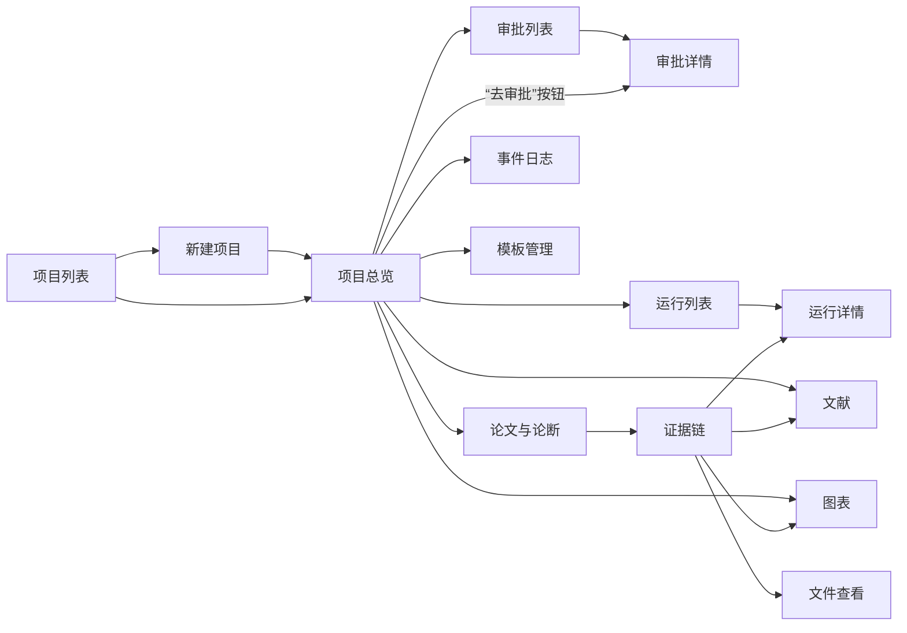

# 详细设计 5：GUI（网页界面）

**文档版本：** v0.1  
**编写日期：** 2026-10-08  
**负责人：** ____（GUI 同学）  
**依据：** 《需求分析》v1.3 第 6.8 节与第 12 节、《概要设计》v0.2、《详细设计 1：Agent 主干》第 9 节（API）  
**读者：** GUI 同学（实现）；主干（核对第 5 节用到的接口）

---

## 0. 先读这一段

你要做的是一个**浏览器里的网页**。它本身不做任何研究工作，只做两件事：

1. **把后台的数据显示出来**：项目进行到哪一步、哪些东西等你批准、实验跑得怎样、论文长什么样；
2. **把用户的操作告诉后台**：批准、退回、暂停、取消、上传模板。

所有数据都通过后台的 **API**（一组网址）获取。例如在浏览器里访问 `http://127.0.0.1:8765/api/projects`，后台就返回一个项目列表（JSON 格式）。后台启动后，打开 `http://127.0.0.1:8765/docs` 能看到全部接口，并且可以直接在网页上点按钮试用——这就是你的对接文档。

**你不需要等后台做完。** 第 1 周用“假数据”（自己写的 JSON 文件）把页面做出来；第 1 周末后台能返回样例项目的真实数据后，切换一个开关就能接上。

**最重要的一条规则：** 网页里不要写任何“研究逻辑”。例如“批准后进入下一阶段”是后台决定的，网页只需要提交“批准”，然后重新读取状态并显示。

---

## 1. 范围

### 1.1 负责的需求

| 需求 | 本文落点 |
|---|---|
| FR-71 最终版本提供轻量 Web GUI | 全文 |
| FR-72 与 CLI 共用状态（前端部分：不在本地保存业务状态，每次从后台读取） | 5.4 |
| FR-73 关闭/刷新浏览器后可恢复查看 | 5.4 |
| 6.8 GUI 最小功能：项目创建、状态、审批、运行查看与控制、产物查看与证据跳转、导出 | 第 4 节 |
| 7.5 可用性：每个阶段显示当前目标、阻塞原因和下一步按钮；结论可查看依据 | 4.3、4.11 |
| 第 12 节场景验收（GUI 相关部分） | 第 10 节 |

### 1.2 本期不做

- 登录、多人协作；
- 流程拖拽编辑器、代码编辑器（只做只读查看 + 简单文本编辑，见 4.13）；
- 图形化证据网络（用列表和链接展示证据链即可）；
- SSH 环境选择（本期只有本地）。

---

## 2. 技术选型

**推荐：Vue 3 + Vite + Element Plus + Vue Router + axios，使用 JavaScript（不用 TypeScript）。** 第 1 周由你最终决定；若选 React，对应为 React + Vite + Ant Design + React Router，本文的页面设计不变。

| 选择 | 理由 |
|---|---|
| Vue 3（组合式 API，`<script setup>`） | 模板语法接近 HTML，入门比 React 平缓；有完整中文文档 |
| Vite | 官方推荐的开发和打包工具，一条命令创建项目 |
| Element Plus | 表格、表单、标签、对话框、时间线、抽屉、上传等组件现成可用，有中文文档；不需要自己写样式 |
| Vue Router | 页面之间跳转 |
| axios | 调用后台接口 |
| JavaScript | 少学一门语言；数据结构以后台 `/docs` 页面为准 |

辅助库（都很小，按需安装）：

| 库 | 用途 |
|---|---|
| `markdown-it` | 显示 `selected.md`、实验计划、过程日志等 Markdown |
| `diff` | 审批时显示与上一版的差异 |
| `dayjs` | 时间格式化（“3 分钟前”） |

**不需要**状态管理库（Pinia）：每个页面自己向后台取数据即可。

### 2.1 第 1 周的学习路线（约 2 天）

1. Vue 官方教程“互动教程”前 10 节（模板语法、响应式、列表渲染、事件、组件、props）；
2. Element Plus “快速开始”，以及 Table、Form、Tag、Dialog、Drawer、Message 六个组件的示例；
3. Vue Router 入门：定义路由、`<router-link>`、`useRoute()` 读取路径参数；
4. 用 axios 请求一个接口并把结果显示在表格里。

遇到问题时，把报错信息和相关代码贴给 AI 编程助手，并要求它解释原因——但提交前要自己读懂。

---

## 3. 工程结构

```text
web/
├── package.json
├── vite.config.js            # 开发时把 /api 代理到 http://127.0.0.1:8765
├── index.html
└── src/
    ├── main.js               # 创建应用，注册 Element Plus 和路由
    ├── App.vue               # 整体布局：左侧菜单 + 顶部项目标题 + 内容区
    ├── router.js             # 路由表（第 4.1 节）
    ├── api/
    │   ├── client.js         # axios 实例、错误统一处理、mock 开关
    │   ├── projects.js       # 每个文件对应一组接口，一个接口一个函数
    │   ├── approvals.js
    │   ├── runs.js
    │   ├── artifacts.js
    │   ├── paper.js
    │   └── stream.js         # SSE 订阅封装（第 5.3 节）
    ├── mock/                 # 假数据（第 5.2 节）
    │   ├── index.js
    │   └── data/*.json
    ├── constants/labels.js   # 状态名 → 中文和颜色（第 7 节）
    ├── components/           # 可复用组件
    │   ├── StateTag.vue      # 各种状态标签
    │   ├── BudgetBar.vue
    │   ├── MarkdownView.vue
    │   ├── DiffView.vue
    │   ├── LogViewer.vue
    │   ├── PdfViewer.vue
    │   ├── EvidenceChain.vue
    │   ├── QuestionCard.vue  # 待回答问题（4.3）
    │   └── EmptyState.vue
    └── pages/                # 每个页面一个文件（第 4 节）
```

---

## 4. 页面设计

### 4.1 页面清单与优先级

| 编号 | 页面 | 路径 | 优先级 |
|---|---|---|---|
| P1 | 项目列表 | `/projects` | 第 1 周 |
| P2 | 新建项目 | `/projects/new` | 第 1 周 |
| P3 | 项目总览（状态页） | `/projects/:pid` | **第 1 周（最重要）** |
| P4 | 审批列表 | `/projects/:pid/approvals` | **第 1 周** |
| P5 | 审批详情 | `/projects/:pid/approvals/:aid` | **第 1 周** |
| P6 | 运行列表 | `/projects/:pid/runs` | 第 2 周 |
| P7 | 运行详情（含实时日志） | `/projects/:pid/runs/:runId` | 第 2 周 |
| P8 | 文献 | `/projects/:pid/literature` | 第 2 周 |
| P9 | 图表 | `/projects/:pid/figures` | 第 2 周 |
| P10 | 论文与论断 | `/projects/:pid/paper` | 第 2 周 |
| P11 | 证据链（抽屉，也可单独打开） | `/projects/:pid/claims/:claimId` | 第 2 周 |
| P12 | 文件查看 | `/projects/:pid/files?path=` | 第 2 周 |
| P13 | 事件日志 | `/projects/:pid/events` | 第 2 周 |
| P14 | 模板管理 | `/projects/:pid/templates` | 第 2 周 |

导出不单独成页，作为 P3 和 P10 上的按钮。

### 4.2 页面跳转关系



进入某个项目后，左侧菜单显示：总览、审批（带待审数量红点）、运行、文献、图表、论文、事件日志、模板。

### 4.3 P3 项目总览（第 1 周最重要的页面）

**作用：** 用户打开项目第一眼要看懂：现在在干什么、卡在哪里、我需要做什么。

**布局（从上到下）：**

1. **标题栏**：项目名、状态标签（`StateTag`）、阶段说明（如“实验：第 1 轮执行中（12/27）”）、进度条；右侧按钮：暂停 / 继续 / 取消项目、导出。
2. **提示条**（有 `blocking_reason` 时显示，黄色）：如“等待你审批实验计划 v2”，旁边按钮“去审批”（跳到 P5）。项目处于 `Paused` / `BudgetExhausted` / `Failed` 时为红色，并显示原因和“继续”按钮。
3. **问题卡片**（`pending_question` 不为空时显示，放在最显眼的位置，组件 `QuestionCard`）：显示问题正文（Markdown）、相关材料链接（如出错运行的日志 → P7），每个选项一个按钮（按钮文字用 `label`）；`allow_text` 为真时显示文本框（选项为空时文本框必填）。提交方式与审批相同（第 6 节）：生成 `request_id`、提交中禁用按钮、收到 409 时提示“问题已被回答或已过期”并刷新。有待回答问题时，“继续”按钮不显示（后台也会拒绝）。
4. **预算卡片**：每个预算类别一个 `BudgetBar`（已用 / 上限，超过 soft 变黄，达到 hard 变红）；“调整上限”按钮打开对话框。
5. **进行中的运行**：最多 5 条，点击进入 P7。
6. **最近动态**：最近 20 条事件，用时间线组件展示；“查看全部”进入 P13。

**接口：** `GET /api/projects/{pid}`（`ProjectStatus`，含 `pending_question`）、`POST /api/projects/{pid}/question/answer`、`GET /api/projects/{pid}/events?limit=20`、`POST /api/projects/{pid}/actions`、`PATCH /api/projects/{pid}/budget`、SSE `/api/projects/{pid}/stream`。

项目列表（P1）中有待回答问题的项目，在待审数量旁显示“有问题待回答”标签。

**按钮规则：** 按钮是否可用只看 `ProjectStatus.next_actions`（后台给出），网页不自己判断状态能做什么。“取消项目”需要二次确认。

### 4.4 P1 项目列表 / P2 新建项目

**P1：** 表格列——标题、状态标签、阶段说明、待审数量、预算使用百分比、最后更新时间。点击行进入 P3。

**P2 表单字段：**

| 字段 | 组件 | 说明 |
|---|---|---|
| 项目标题 | 输入框 | 必填 |
| 研究想法 | 多行文本框 | 必填，提示示例：“研究小型文本分类模型在数据很少时，哪种微调方法更好……” |
| 约束 | 三个输入框：算力、时间、数据 | 可选 |
| 任务配置 | 下拉框，选项来自 `GET /api/tasks` | 必填 |
| 预算 | LLM 费用上限（美元）、墙钟时间上限（小时） | 有默认值 |
| 论文模板 | 上传 zip（可选） | 不上传则用默认模板 |
| 高级：开启论断-证据检查 | 开关，默认开 | 对比实验用，平时不动 |

提交顺序：先 `POST /api/projects` 创建，拿到 `project_id` 后若选了模板再 `POST /api/projects/{pid}/templates` 上传，最后跳到 P3。

### 4.5 P4 审批列表 / P5 审批详情（第 1 周最重要的页面之二）

**P4：** 两个标签页“待处理”和“历史”。表格列：类别（idea / 实验计划 / 过程日志 / 最终手稿，用不同颜色标签）、对象与版本（如 `plan/experiment_plan.md v2`）、摘要、提交时间、状态。

**P5 布局：**

- **左侧（约 2/3）——要审的内容：**
  - idea、计划、过程日志：用 `MarkdownView` 显示；文件开头的 YAML 区块折叠显示为代码；
  - 最终手稿：`PdfViewer` 显示 PDF，下方显示核验报告摘要（blocker / major / minor 数量）；
  - 顶部开关“与上一版对比”：打开后用 `DiffView` 显示差异（需求 6.8 本期允许退化为左右并列显示两版全文——内容超过 3,000 行或差异计算太慢时自动退化）。
- **右侧（约 1/3）——决策区：**
  - 变更摘要（`summary`）、影响范围（`impact`）；
  - 相关材料链接（`extra_refs`，如评分表、差异表、执行前检查结果、核验报告），点击在抽屉中打开；
  - 意见输入框；
  - 三个按钮：**批准**（绿）、**退回修改**（黄，意见必填）、**拒绝**（红，意见必填，二次确认）。

**特别规则：** 最终手稿的核验报告中有 blocker 时，批准按钮旁显示红色提示“仍有 N 个阻断问题”，且意见必填（后台也会校验）。

**接口：** `GET /api/projects/{pid}/approvals`、`GET /api/projects/{pid}/approvals/{aid}`、`POST /api/projects/{pid}/approvals/{aid}/decision`。

提交的防重复处理见第 6 节。

### 4.6 P6 运行列表 / P7 运行详情

**P6：** 表格列——运行编号、实验 ID、类型（基线 / 主方法 / 消融 / 复现 / 试运行……）、任务键、状态标签、耗时、主要指标值、“重试自”（链接到原运行）。可按实验 ID 和状态筛选。

**P7 布局：**

1. 基本信息：`run.json` 的主要字段（实验、类型、代码提交、配置文件链接 → P12、种子、评价条件）；
2. 状态：状态标签、开始/结束时间、退出码、失败原因（中文说明，见第 7 节）。运行处于 `queued` / `running` 时，除 SSE 外每 5 秒重新请求一次运行详情，确保状态不会停在旧值；
3. 指标表：`metrics.jsonl` 的内容；
4. 日志：`LogViewer`，stdout / stderr 两个标签页；运行中时实时追加（第 5.3 节），默认自动滚动到底部，可关闭自动滚动；只保留最近 5,000 行，并提示“完整日志可下载”；
5. 环境摘要（折叠面板）；
6. “取消运行”按钮：仅 `queued` / `running` 时可用，二次确认。

**接口：** `GET /runs`、`GET /runs/{run_id}`、`GET /runs/{run_id}/logs?stream=&offset=`、SSE `/runs/{run_id}/logs/stream`、`POST /runs/{run_id}/cancel`。

### 4.7 P8 文献

表格列：标题、作者（前 3 位）、年份、会议/期刊、访问层级标签（**“仅基于摘要”用橙色醒目显示**，需求第 12 节场景）、相关性分、是否精读。点击行打开抽屉：摘要、链接（新标签页打开）、阅读卡列表——每条显示内容、“作者结论 / Agent 推断”标签、出处位置、原文片段、片段是否核对通过（✓ / ⚠）。

### 4.8 P9 图表

卡片网格：每张图显示 PNG 缩略图和图注。点击打开详情：大图、规格、数据来源（汇总 ID → 跳 P10 的证据或显示汇总表）、全部输入运行（链接 → P7）。

### 4.9 P10 论文与论断

- **左侧：** `PdfViewer`，上方版本下拉框（选项来自 `GET /paper` 返回的 PDF 版本列表，即产物 `paper/build/main.pdf` 的各个版本）；“导出”按钮（论文 / 完整研究档案）；
- **右侧标签页：**
  - **论断**：列表，每条显示论断文本（把 `\airval{...}` 显示为实际数字）、章节、支持程度标签、问题数；可按支持程度和章节筛选；点击打开 P11 证据链抽屉；
  - **核验报告**：`MarkdownView` 显示最新报告；
  - **编译报告**：错误与警告列表。

关闭证据检查的项目没有论断清单，“论断”标签页显示说明“本项目未开启论断-证据检查”。

### 4.10 P11 证据链

用竖向步骤条展示一条论断的追溯链（需求 1.3 第 6 点“论文结论 → 图表 → 实验运行 → 代码提交 → 配置/数据版本”）：

```text
论断 CL3：LoRA 在 500 条训练样本时准确率 84.6%……        [supported ✓]
  └ 图表 fig_c1（缩略图，点击 → P9）
      └ 汇总 C1 v2：lora / 500 / accuracy / mean = 0.8463（重算值 0.8463 ✓）
          └ 运行 r-…a1b2、r-…c3d4、r-…e5f6（点击 → P7）
              ├ 代码提交 9f2c1ab
              ├ 配置 configs/E2/E2-train_size=500-seed=0.yaml（点击 → P12）
              └ 数据 sst2/train sha256 3a7f…
  核验问题：无
```

**接口：** `GET /api/projects/{pid}/claims/{claim_id}/trace`（返回 `EvidenceTrace`，结构见主干详细设计 9.4）。

### 4.11 P12 文件查看 / P13 事件日志 / P14 模板管理

- **P12：** 只读显示工作区内一个文本文件（配置、代码、日志），等宽字体；`GET /api/projects/{pid}/files?path=`。
- **P13：** 事件时间线，可按类型筛选、按关键词搜索（需求 FR-03“搜索某个 idea 或运行”），滚动到底部加载更多（`after_seq` 分页）。
- **P14：** 上传模板 zip；显示当前使用的模板（默认模板或某个上传版本）；列表显示每个模板版本的检查结果（入口文件及是否由用户选定、缺失的依赖、最小编译是否成功）。模板有多个入口或缺少依赖时，论文阶段会提问，问题出现在 P3 的问题卡片中，P14 只显示结果并提供“去回答”链接。

### 4.12 通用要求

- 每个页面都要有**加载中**（骨架屏或 loading）、**空状态**（`EmptyState`，如“还没有运行记录”）和**出错**（提示 + “重试”按钮）三种状态；
- 所有时间显示为本地时间，鼠标悬停显示完整时间；
- 所有文件路径、运行编号可一键复制。

### 4.13 简单文本编辑（第 3 周视时间）

在 P5 审批详情中，对 `selected.md`、实验计划提供“编辑”按钮：打开文本框修改后 `PUT /api/projects/{pid}/artifacts/content`（带 `base_sha256`），后台会登记为 `human-edited` 新版本（需求 FR-52）。

---

## 5. 与后台通信

### 5.1 接口调用封装（`api/client.js`）

```js
import axios from 'axios'
import { ElMessage } from 'element-plus'

export const http = axios.create({ baseURL: '/api', timeout: 20000 })

http.interceptors.response.use(
  (res) => res.data,
  (err) => {
    const e = err.response?.data?.error
    // 409 交给调用方处理（审批过期），其余统一弹提示
    if (err.response?.status !== 409) ElMessage.error(e?.message || '无法连接后台，请确认后台已启动')
    return Promise.reject(err)
  },
)
```

每个接口写成一个函数，页面只调用函数，不直接写网址：

```js
// api/approvals.js
export const listApprovals = (pid, status) => http.get(`/projects/${pid}/approvals`, { params: { status } })
export const getApproval   = (pid, aid) => http.get(`/projects/${pid}/approvals/${aid}`)
export const decide = (pid, aid, body) => http.post(`/projects/${pid}/approvals/${aid}/decision`, body)
```

### 5.2 假数据模式

`.env.development` 中设置 `VITE_USE_MOCK=true` 时，`api/` 中的函数改为返回 `mock/data/` 下的 JSON：

```js
// api/projects.js
import { USE_MOCK, mock } from '../mock'
export const getProject = (pid) => USE_MOCK ? mock('project_status.json') : http.get(`/projects/${pid}`)
```

- 假数据的字段**照抄主干详细设计第 9 节的结构**；第 1 周末后台能返回样例项目数据后，可以直接从 `http://127.0.0.1:8765/api/...` 复制真实返回值替换假数据；
- 第 2 周起默认关闭假数据，只在后台未启动时使用。

### 5.3 实时更新（SSE）

后台用 SSE（服务器推送事件）通知网页“有东西变了”。浏览器自带 `EventSource`，不需要安装库：

```js
// api/stream.js
export function subscribeProject(pid, handlers) {
  const es = new EventSource(`/api/projects/${pid}/stream`)
  for (const type of ['state', 'event', 'approval', 'question', 'run', 'budget']) {
    es.addEventListener(type, (msg) => handlers[type]?.(JSON.parse(msg.data)))
  }
  es.onerror = () => handlers.onDisconnect?.()   // 浏览器会自动重连
  return () => es.close()                         // 离开页面时调用，关闭连接
}
```

**使用原则：SSE 只当作“通知”，收到后重新调用 REST 接口拿完整数据。** 例如 P3 收到 `state`、`approval` 或 `question` 事件后，0.5 秒内重新请求 `GET /api/projects/{pid}`（多个事件连续到达时只请求一次）。这样即使漏掉某条推送，页面也不会显示错误的数据。

连接断开时页面顶部显示灰色提示“与后台的连接已断开，正在重连……”；若 SSE 不可用，退化为每 10 秒轮询一次。

日志流：P7 对运行中的运行订阅 `/runs/{run_id}/logs/stream`，每收到一行就追加；运行结束后关闭订阅。

### 5.4 不在浏览器里保存业务状态

- 项目状态、审批、运行等全部从后台读取，**不存在 localStorage 中**；
- 刷新或关闭浏览器后再打开，页面重新请求即恢复（需求 FR-73，第 12 节场景“关闭浏览器或 CLI 客户端”）；
- 只允许把“界面偏好”存在 localStorage（如日志自动滚动开关、表格每页条数），读写都用 `try/catch` 包裹。

### 5.5 开发与交付

```js
// vite.config.js
export default defineConfig({
  plugins: [vue()],
  server: { proxy: { '/api': 'http://127.0.0.1:8765' } },
})
```

- 开发：先启动后台 `air serve`，再在 `web/` 下 `npm run dev`；
- 交付：`npm run build` 生成 `web/dist/`，后台会直接提供这些文件，用户只需打开 `http://127.0.0.1:8765/`。

---

## 6. 审批提交：防重复与过期处理

这是需求中明确要求、也最容易出错的地方（FR-72、第 12 节场景“GUI 提交过期或重复审批”）。

```js
// P5 中的提交逻辑（示意）
const requestId = ref(crypto.randomUUID())   // 打开审批详情时生成一次
const submitting = ref(false)

async function submit(decision) {
  if (submitting.value) return                // 1. 提交中再点无效
  submitting.value = true
  try {
    await decide(pid, aid, {
      decision,
      comment: comment.value,
      expected_sha256: approval.value.target.sha256,   // 2. 告诉后台“我审的是这个版本”
      request_id: requestId.value,                       // 3. 同一次操作的重试用同一个 ID
    })
    ElMessage.success('已提交')
    router.push(`/projects/${pid}`)
  } catch (err) {
    if (err.response?.status === 409) {                  // 4. 版本过期或已被处理
      ElMessage.warning('该版本已过期或已被处理，已刷新为最新状态')
      await reload()
      requestId.value = crypto.randomUUID()
    }
  } finally {
    submitting.value = false
  }
}
```

| 情况 | 网页行为 | 后台保证 |
|---|---|---|
| 连续点击两次 | 第二次被 `submitting` 挡住 | 即使到达后台，同一 `request_id` 只处理一次 |
| 网络超时后用户重试 | 沿用同一个 `request_id` | 返回第一次的结果，不重复触发实验 |
| 在 CLI 中已经批准，GUI 页面还开着 | 提交后收到 409，提示并刷新 | 拒绝过期请求 |
| 审批对象已有新版本 | 同上 | 旧审批标为 superseded |

回答问题、暂停、继续、取消运行等其他写操作同样带 `request_id`，按钮在请求期间显示 loading 并禁用。

---

## 7. 状态显示对照表（`constants/labels.js`）

后台返回的是英文枚举值，网页统一在这一个文件里转换为中文和颜色。

**项目状态（`ProjectState`）**

| 值 | 中文 | 颜色 |
|---|---|---|
| IdeaDrafting | 选题中 | 蓝 |
| IdeaPending | 等待审批 idea | 黄 |
| PlanDrafting | 制定实验计划 | 蓝 |
| PlanPending | 等待审批计划 | 黄 |
| Executing | 实验执行中 | 蓝 |
| Analyzing | 分析结果 | 蓝 |
| LogPending | 等待审批过程日志 | 黄 |
| Writing | 撰写论文 | 蓝 |
| ManuscriptPending | 等待审批最终手稿 | 黄 |
| Completed | 已完成 | 绿 |
| Paused | 已暂停 | 灰 |
| BudgetExhausted | 预算已用尽 | 红 |
| Failed | 出错停止 | 红 |

**运行状态（`RunState`）与失败原因**

| 值 | 中文 | | 失败原因 | 中文 |
|---|---|---|---|---|
| created / preparing | 准备中 | | nonzero_exit | 程序报错退出 |
| queued | 排队中 | | timeout | 超时 |
| running | 运行中 | | cancelled | 已取消 |
| succeeded | 成功 | | lost | 进程丢失（后台重启时发现） |
| failed | 失败 | | oom | 内存不足 |
| cancelled | 已取消 | | missing_metrics | 未输出必需指标 |
| unknown | 状态未知（需人工确认） | | wrapper_error | 运行包装器出错 |

**审批：** pending 待处理（黄）、approved 已批准（绿）、changes_requested 已退回（橙）、rejected 已拒绝（红）、superseded 已被新版本取代（灰）。类别：idea、实验计划、过程日志、最终手稿。

**论断支持程度：** supported 有依据（绿）、partially_supported 部分有依据（黄）、unsupported 无依据（红）、contradicted 与证据相反（深红）、unverifiable 无法核验（灰）。

**运行类型：** baseline 基线、main 主方法、ablation 消融、control 对照、replication 复现、exploration 探索、trial 试运行。

后台新增枚举值时，网页显示原始英文值而不是报错（在 `labels.js` 中提供默认值）。

---

## 8. 需要后台提供的接口（核对清单）

以下接口均在主干详细设计第 9.2 节中定义；第 1 周末请与组长逐条核对，缺的记在这里：

| 页面 | 接口 |
|---|---|
| P1、P2 | `GET/POST /api/projects`、`GET /api/tasks`、`POST /templates` |
| P3 | `GET /api/projects/{pid}`、`POST /question/answer`、`POST /actions`、`PATCH /budget`、`GET /events`、SSE `/stream` |
| P4、P5 | `GET /approvals`、`GET /approvals/{aid}`、`POST /approvals/{aid}/decision`、`GET /artifacts/content` |
| P6、P7 | `GET /runs`、`GET /runs/{run_id}`、`GET /runs/{run_id}/logs`、SSE `/runs/{run_id}/logs/stream`、`POST /runs/{run_id}/cancel` |
| P8 | `GET /literature`、`GET /literature/{paper_id}` |
| P9 | `GET /figures`、`GET /files?path=`（PNG） |
| P10、P11 | `GET /paper`、`GET /paper/pdf`、`GET /claims`、`GET /claims/{claim_id}/trace`、`GET /export` |
| P12、P13、P14 | `GET /files`、`GET /events`、`GET/POST /templates` |

PDF 预览直接用浏览器自带的查看器：`<iframe :src="`/api/projects/${pid}/paper/pdf?version=${v}`" />`，并提供“在新标签页打开”链接。

---

## 9. 测试

- **手动测试为主：** 每完成一个页面，用样例项目数据把加载、空状态、出错三种情况都看一遍；
- **必须测试的交互：** 审批的四种情况（第 6 节表格）；运行中关闭页面再打开；后台停止时页面的提示；
- 可选：用 Vitest 为 `labels.js` 和数据转换函数写几个单元测试。

---

## 10. 评价任务

### 10.1 端到端演示（第 2 周末检查点 + 第 3 周正式录制）

用 GUI 完整走一遍，并录屏：创建项目 → 审批 idea → 审批实验计划 → 查看运行与实时日志 → 审批过程日志 → 上传模板 → 预览论文 → 点击论断查看证据链 → 审批最终手稿 → 导出。录屏控制在 5 分钟内（可剪辑等待时间）。

### 10.2 场景验收（需求第 12 节，SSH 场景除外）

在 `eval/acceptance/checklist.md` 中逐条记录：操作步骤、预期、实际结果、截图。与 GUI 直接相关的场景：

| 场景 | 在 GUI 中如何验证 |
|---|---|
| CLI 创建项目后转到 GUI | 用 `air new` 创建，在 P1 中能看到并继续审批 |
| 关闭浏览器或 CLI 客户端 | 运行中关闭页面，几分钟后重开 P7，日志和状态连续 |
| GUI 提交过期或重复审批 | 在 CLI 批准后再在 GUI 批准，看到过期提示；快速双击批准只生效一次 |
| 用户拒绝重要过程日志 | 在 P5 拒绝，确认原始运行仍在 P6 中、日志新版本出现 |
| 中途预算用尽 | 把预算上限调低，观察 P3 的红色提示与停止原因 |
| 论文出现错误数字或无效引用 | 用样例项目（含故意错误的论断），在 P10 看到被标红的论断 |
| 用户上传模板缺少样式文件 | 上传缺 `.sty` 的模板，P14 显示缺失项，P3 出现问题卡片；上传修复版本后回答“已上传”，流程继续 |
| 实验修复多次仍失败 | 用冒烟任务的 `fail_mode: exit1`，P3 出现问题卡片，选择“跳过”后流程继续 |
| 论文全文无法取得 | P8 中显示“仅基于摘要”标签 |
| 用 GUI 完成最终演示 | 10.1 |

### 10.3 操作负担

记录完整演示中用户需要的操作次数（点击 + 输入）和用户实际操作时间（不含等待），作为“端到端体验”的量化证据（需求 8 节）。

### 10.4 盲评

作为主对照实验的两名盲评员之一，按论文同学制定的评分标准独立评分（不要和另一位评审员讨论，直到各自完成）。

---

## 11. 三周任务清单

**第 1 周（10-07 ~ 10-13）**

- [ ] 选定框架（推荐 Vue 3 + Element Plus），完成 2.1 的学习路线
- [ ] `npm create vite@latest` 创建 `web/`，装好 Element Plus、Vue Router、axios，做出左侧菜单布局
- [ ] 按主干第 9 节写假数据
- [ ] **P3 项目总览、P4 审批列表、P5 审批详情**（用假数据）
- [ ] P1、P2
- [ ] 周末：检查进度，若明显落后，与组长商量缩减页面

**第 2 周（10-14 ~ 10-20）**

- [ ] 接入真实后台（关闭假数据），处理错误提示
- [ ] SSE 实时更新、审批与问题回答的防重复（第 6 节）、问题卡片
- [ ] P6、P7（含实时日志）
- [ ] P8、P9、P10、P11（PDF 预览、证据跳转）
- [ ] P12、P13、P14
- [ ] **周末：** 与组长联调，用 GUI 跑通第 2 周检查点

**第 3 周（10-21 ~ 10-28）**

- [ ] 修复联调发现的问题；`npm run build` 交付
- [ ] 端到端演示录屏；场景验收；操作负担统计
- [ ] 盲评
- [ ] 撰写报告中“系统界面与端到端体验”章节

---

## 12. 待讨论

1. 框架最终选择（第 1 周第一次组会前决定）。
2. 若第 1 周末进度落后，优先保留的页面顺序：P3 → P5 → P4 → P7 → P10/P11 → 其余。
3. 是否需要文本编辑（4.13），第 3 周视时间。
